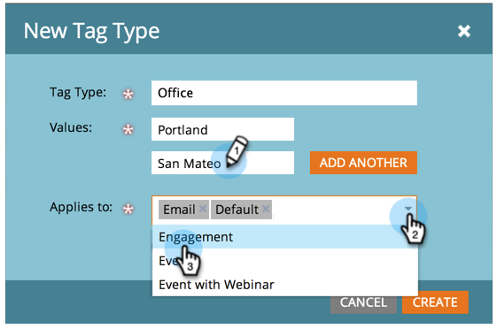

# Create a New Program Tag and Tag Values {#create-a-new-program-tag-and-tag-values}

>[!NOTE]
>
>**Admin Permissions Required**

You can create custom  [tags](../../../product-docs/core-marketo-concepts/programs/working-with-programs/understanding-tags.md) for your programs and assign values to the tag.

>[!NOTE]
>
>**Example**
>
>Program Tag: Target Audience
>
>Program Tag Value: SMB, Enterprise, Mid-Market

1. Under **Admin**, click **Tags**. 

   

1. Click **New** and select **New Tag Type**.

   

1. Enter the **Tag Type** and a tag **Value**. Then click **Add Another**.

   

1. Enter as many Values as you need. Select which program types you want this tag to apply to.

   

   >[!TIP]
   >
   >You can select multiple program types. When a new program is made, this tag type will be available.

1. Check **Required** and click **Create**.

   

   >[!NOTE]
   >
   >If the tag type is **Required**, users will be required to enter a value for the tag when creating a new program.

   

Now when your users create a program, they will have to set the custom value for the tag created. 