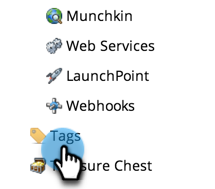
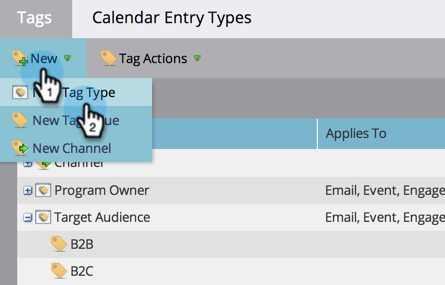
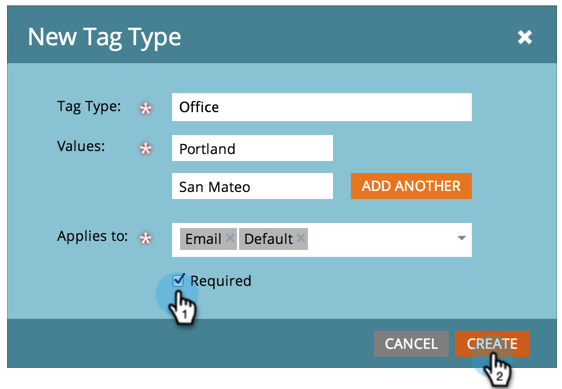
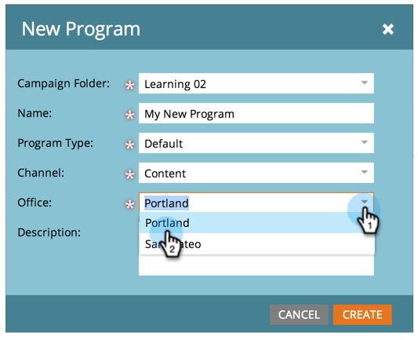

# Create a New Program Tag and Tag Values {#create-a-new-program-tag-and-tag-values}

>[!NOTE]
>
>**Admin Permissions Required**

You can create custom [tags](/help/marketo/product-docs/core-marketo-concepts/programs/working-with-programs/understanding-tags.md) for your programs and assign values to the tag.

>[!NOTE]
>
>**Example**
>
>Program Tag: Target Audience
>
>Program Tag Value: SMB, Enterprise, Mid-Market

1. Go to the **[!UICONTROL Admin]** area.

   

1. Click **[!UICONTROL Tags]**.

   

1. Click **[!UICONTROL New]** and select **[!UICONTROL New Tag Type]**.

   

1. Enter the **[!UICONTROL Tag Type]** and a tag **[!UICONTROL Value]**. Then click **[!UICONTROL Add Another]**.

   

1. Enter as many Values as you need. Select which program types you want this tag to apply to.

   

   >[!TIP]
   >
   >You can select multiple program types. When a new program is made, this tag type will be available.

1. Check **[!UICONTROL Required]** and click **[!UICONTROL Create]**.

   

   >[!NOTE]
   >
   >If the tag type is **[!UICONTROL Required]**, users will be required to enter a value for the tag when creating a new program.

   

Now when your users create a program, they will have to set the custom value for the tag created.
