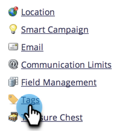
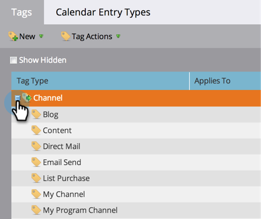
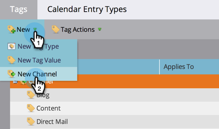
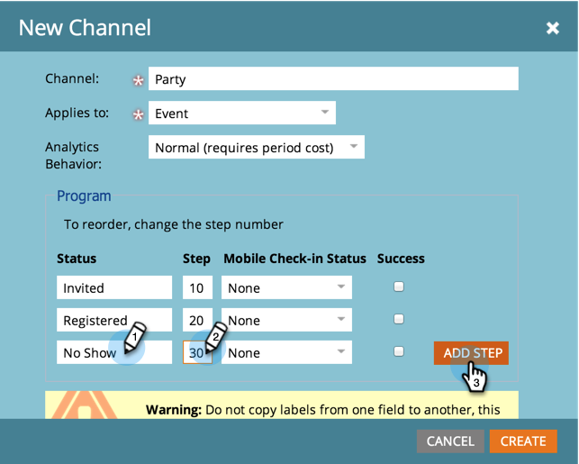
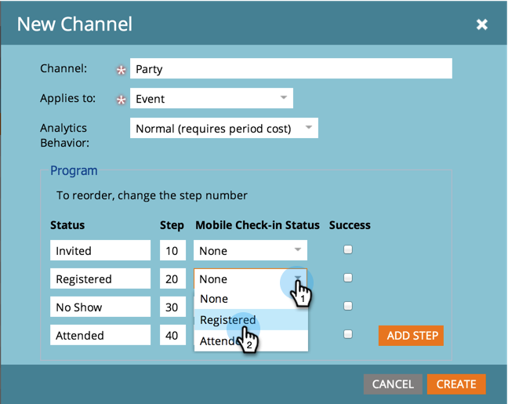
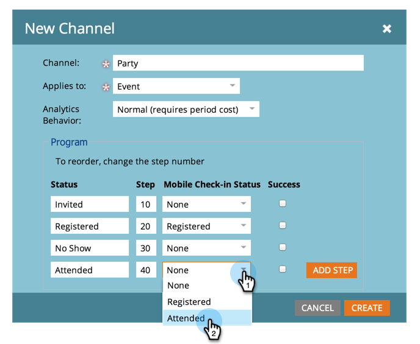

# Create a Program Channel {#create-a-program-channel}

A program is one specific marketing initiative. The channel is intended to be the delivery mechanism, like Webinar or Sponsorship or Online Ad.

>[!NOTE]
>
>**Admin Permissions Required**

>[!NOTE]
>
>Learn more about [programs](/help/marketo/product-docs/core-marketo-concepts/programs/creating-programs/understanding-programs.md), the most important element in Marketo.

1. Go to the **[!UICONTROL Admin]** area.

   

1. Click **[!UICONTROL Tags]**.

   

   >[!NOTE]
   >
   >Why tags? A channel is a way of describing a program, just like other tags. The channel just has special extra features.

1. Click the **+** sign next to [!UICONTROL Channel] to expand and see existing channels.

   

1. Under **[!UICONTROL New]**, click **[!UICONTROL New Channel]**.

   

   >[!NOTE]
   >
   >**Example**
   >
   >Channel: Billboard
   >
   >* Apply to: Default
   >* Progression: Member, Engaged (If in doubt, these work fine)
   >* Success: Engaged
   >
   >Channel: Party
   >
   >* Apply to: Event
   >* Progression: Invited, Registered, No Show and Attended
   >* Success: Attended
   >
   >Check out the Progressions of existing channels to get an idea of how to use them.

1. Let's go with the Party channel example. Name your new **Channel** and select the program type it will apply to.

   

   >[!NOTE]
   >
   >Apply to what? There are several types of programs. Match the channel to the right type. If in doubt, choose **[!UICONTROL Default]**.

   >[!NOTE]
   >
   >When using "[!UICONTROL Event with Webinar]," system mappings will be locked (as required by webinar integrations) and cannot be edited.

1. Enter the first two program Status names, then click **[!UICONTROL Add Step]**.

   

1. Enter another program **[!UICONTROL Status]** and **[!UICONTROL Step]** number, then click **[!UICONTROL Add Step]**.

   

   >[!TIP]
   >
   >The **[!UICONTROL Step]** number is used for sorting of program statuses. Keep in mind that people cannot go backwards in these progression steps. They can only change status to a higher or equal value status. Use the equal values when statuses are intended to switch back and forth as opposed to a progression.

1. Enter the last program **[!UICONTROL Status]** and **[!UICONTROL Step]** number.

   

   >[!NOTE]
   >
   >When using the type "[!UICONTROL Event]," system mapping for Registered, Waitlisted, and Attended statuses is required. As such, those statuses cannot be hidden.

1. Pick the **[!UICONTROL Mobile Check-in Status]** for **[!UICONTROL Registered]**.

   

1. Pick the **[!UICONTROL Mobile Check-in Status]** for **[!UICONTROL Attended]**.

   

   >[!NOTE]
   >
   >**[!UICONTROL Mobile Check-in Status]** options will only be available if the channel will be for event programs.

   >[!NOTE]
   >
   >Only people with a **[!UICONTROL Mobile Check-in Status]** of **[!UICONTROL Registered]** and **[!UICONTROL Attended]** will be visible in the [Mobile Check-in Apps](/help/marketo/product-docs/core-marketo-concepts/mobile-apps/event-check-in/event-check-in-overview.md).

   >[!TIP]
   >
   >If a new person is created in the mobile check-in app, it will be set to Registered in the event program. If a person is checked into the event on the app, it will be set to Attended in the event program.

1. Select the **[!UICONTROL Success]** program status, then click **[!UICONTROL Create]**.

   

   Nicely done! When you make a new program of that type, this new channel will be one of the choices.
