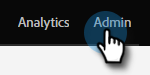
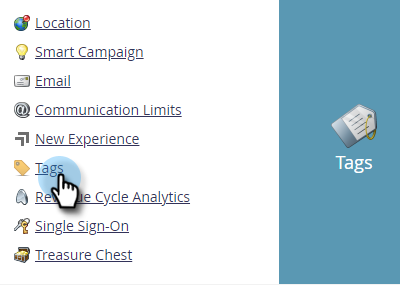
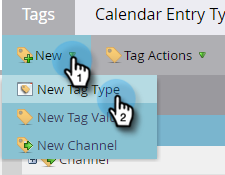
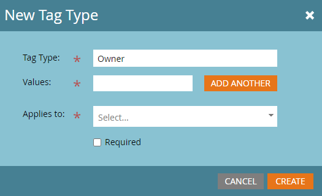
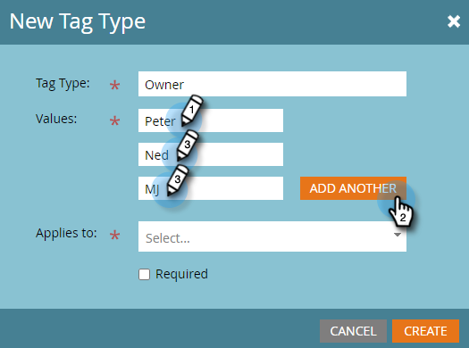
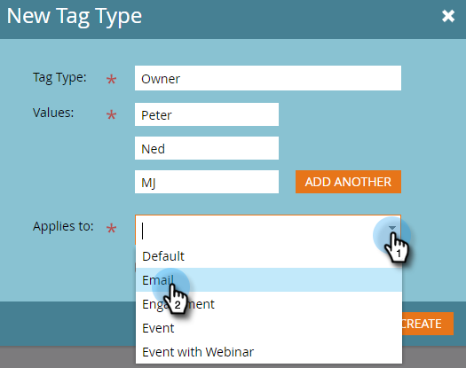
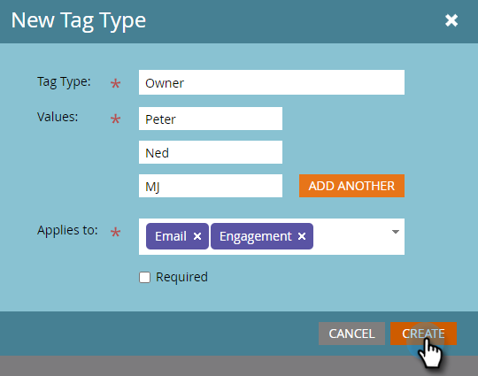

# Create Custom Tags {#create-custom-tags}

Tags will help you organize your programs while channels will assist in gathering data for reporting purposes.

>[!NOTE]
>
>Check out [Understanding Tags](/help/marketo/product-docs/core-marketo-concepts/programs/working-with-programs/understanding-tags.md) for more information.

>[!NOTE]
>
>**Admin Permissions Required**

## Create a New Tag Type {#create-a-new-tag-type}

To create a new tag type:

1. Go to the **[!UICONTROL Admin]** section.

   

1. Click **[!UICONTROL Tags]**.

   

1. Click **[!UICONTROL New]** and select **[!UICONTROL New Tag Type].**

   

1. Enter a name for the Tag Type.

   

1. Enter the desired Value for the Tag Type. Click **[!UICONTROL Add Another]** to enter additional values.

   

1. Select which Program type(s) this tag applies to.

   

1. Decide whether or not to make this tag required for all the program types listed.

   

   >[!NOTE]
   >
   >* Select "[!UICONTROL Required]" if you want this tag added any time a new program is created.
   >* Removing a program type from the ‘[!UICONTROL Applies to]’ list will delete the tag and its values from all existing programs of that type. If you want to preserve existing tag values and make this tag optional moving forward for _all_ program types listed, leave the "Required" checkbox unselected.

   >[!TIP]
   >
   >If you want to make a similar tag required for some program types but optional for others, you'll need to set up two separate tags, each applying to different program types with one with "[!UICONTROL Required]" selected, and the other with "[!UICONTROL Required]" not selected.

1. Click **[!UICONTROL Create]**.

   
