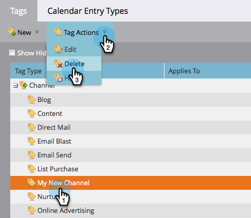

# Delete a Program Channel {#delete-a-program-channel}

Program channels are a collection of statuses or checkpoints leads should go through in a program.

If you make one by accident or no longer need one, you can delete it.

1. Go to the **Admin** area.

   

1. Click **Tags**.

   

1. Select the channel you want to delete, under Tag Actions, click Delete.

   >[!TIP]
   >
   >If the channel is associated with any program(s), you can't delete, only hide.

   

Bam! You can also [delete specific statuses from channels](/help/marketo/product-docs/administration/tags/delete-a-program-status-from-a-program-channel.md).
