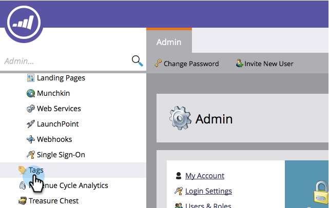
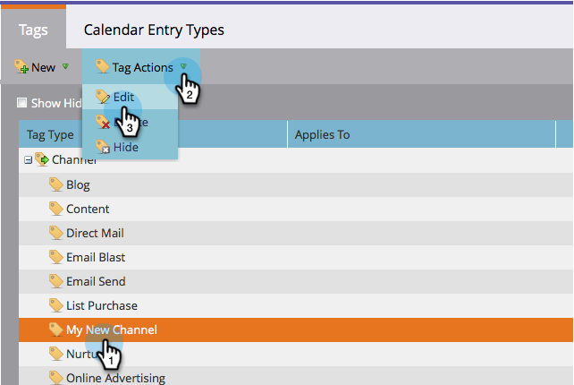

# Delete a Program Status From a Program Channel {#delete-a-program-status-from-a-program-channel}

Program statuses are the checkpoints through a programs path (channel). If you make a status by mistake or no longer need it, feel free to delete it.

1. Go to the **Admin** section.

   

1. Click **Tags**.

   

1. Select the channel you want to remove a status from, then under **Tag Actions**, click **Edit**.

   

1. Click  to remove the status, then click **SAVE**.

   >[!TIP]
   >
   >If any person is currently assigned to the status in question, you cannot delete it, you can however hide it.

   

Nicely done! You can also [delete an entire channel](delete-a-program-channel.md) if you need to.
