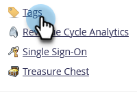
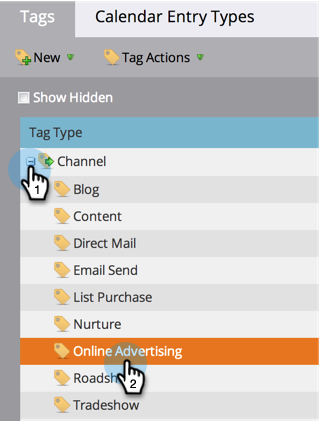
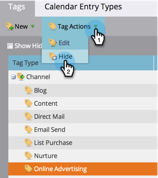

# Hide/Unhide a Program Channel {#hide-unhide-a-program-channel}

>[!NOTE]
>
>**Admin Permissions Required**

You can [delete a program channel](/help/marketo/product-docs/administration/tags/delete-a-program-channel.md) if it isn't being used by any programs.  However, once it is used, we need to keep it around.  However, you can hide it if you no longer need it.

## Hide a Program Channel {#hide-a-program-channel}

1. Go to the **[!UICONTROL Admin]** area.

   

1. Click **[!UICONTROL Tags]**.

   

1. Click on the **[!UICONTROL Channel]** drop-down and select the **[!UICONTROL Channel]** to hide.

   

1. Under **[!UICONTROL Tag Actions]**, click on **[!UICONTROL Hide]**.

   

Easy come, easy go!

## Unhide a Program Channel {#unhide-a-program-channel}

1. Unhide a Program Channel by checking the Show Hidden checkbox.

   
