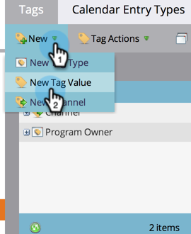
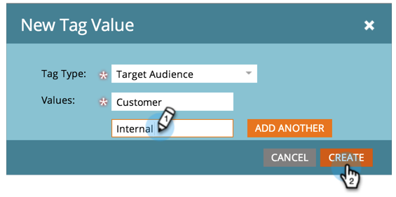
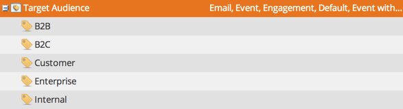
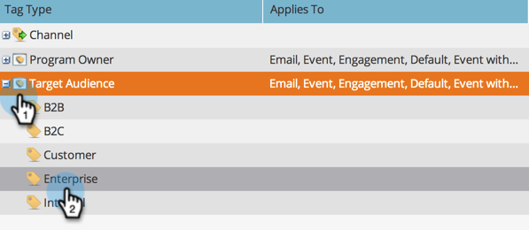
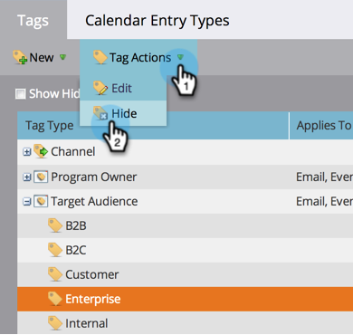
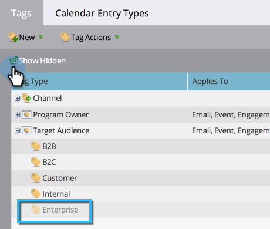

# Managing Tag Values {#managing-tag-values}

[Tags](/help/marketo/product-docs/core-marketo-concepts/programs/working-with-programs/understanding-tags.md) are used to describe programs. You can make as many as you need, each with unique values. Here's how to manage those values.

>[!NOTE]
>
>**Admin Permissions Required**

>[!PREREQUISITES]
>
>[Create a New Program Tag and Tag Values](/help/marketo/product-docs/administration/tags/create-a-new-program-tag-and-tag-values.md)

## Adding Tag Values {#adding-tag-values}

1. Go to the **[!UICONTROL Admin]** area.

   

1. Click **[!UICONTROL Tags]**.

   

1. Click **[!UICONTROL New]**, then **[!UICONTROL New Tag Value]**.

   

1. Select the **[!UICONTROL Tag Type]**.

   

1. Enter a **[!UICONTROL Value]** and click **[!UICONTROL Add Another]**. You can add as many values as you'd like.

   

1. Add the remaining values and click **[!UICONTROL Create]**.

   

You should see the changes immediately!

   

## Hiding Tag Values {#hiding-tag-values}

Tags might be used by old programs. You can deprecate them for future use by hiding the tag type.

1. Select the **[!UICONTROL Tag]** and select the **[!UICONTROL Value]** you want to hide.

   

1. Under **[!UICONTROL Tag Actions]**, select **[!UICONTROL Hide]**.

   

## Show Hidden Values {#show-hidden-values}

If you want to see your hidden values again, do the following:

1. Select the **[!UICONTROL Show Hidden]** checkbox. Once checked, you can see the hidden value.

   

You can then unhide the values you would like to use in the future.
