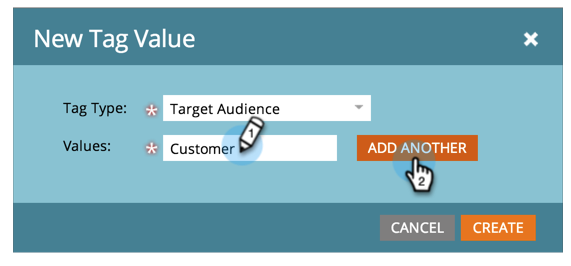

# Managing Tag Values {#managing-tag-values}

[Tags](../../../product-docs/core-marketo-concepts/programs/working-with-programs/understanding-tags.md) are used to describe programs. You can make as many as you need, each with unique values. Here's how to manage those values.

>[!NOTE]
>
>**Admin Permissions Required**

>[!NOTE]
>
>**Prerequisites**
>
>[Create a New Program Tag and Tag Values](create-a-new-program-tag-and-tag-values.md)

### What's in this article? {#whats-in-this-article}

[Adding Tag Values](#adding-tag-values)  
[Hiding Tag Values](#hiding-tag-values)  
[Show Hidden Values](#show-hidden-values)

#### Adding Tag Values {#adding-tag-values}

1. Under **Admin**, click **Tags**. 

   

1. Click** New**, then **New Tag Value**.

   

1. Select the **Tag Type**.

   

1. Enter a **Value**&nbsp;and click **Add Another**.&nbsp;You can add as many values as you'd like.

   

1. Add the remaining values and click **Create**.

   

1. &nbsp;You should see the changes immediately!

   

#### Hiding Tag Values {#hiding-tag-values}

Tags might be used by old programs. You can deprecate them for future use by hiding the tag type.

1. Select the**&nbsp;****Tag**&nbsp;and select the&nbsp;**Value**&nbsp;you want to hide.

   

1. Under **Tag Actions**, select **Hide**.

   

#### Show Hidden Values {#show-hidden-values}

If you want to see your hidden values again, do the following:

1. Select the Show Hidden box. Once checked, you can see the hidden value.

   

   You can then unhide the values you would like to use in the future.

