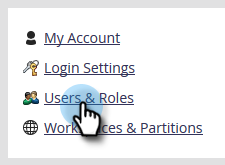
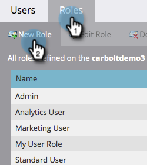
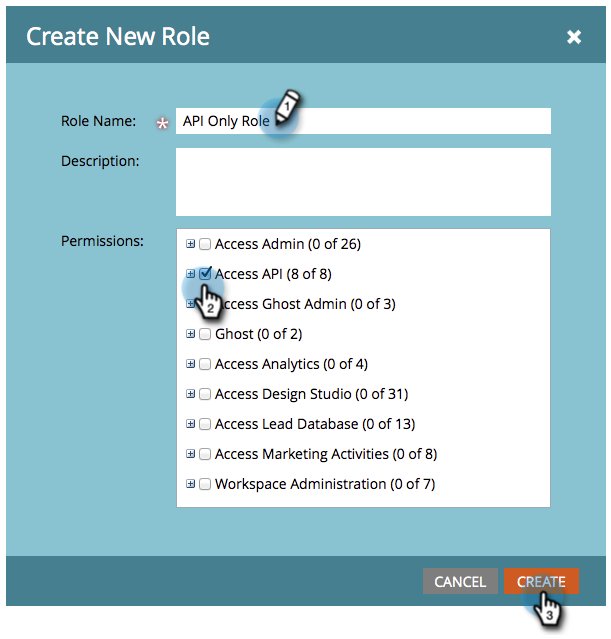

# Create an API Only User Role {#create-an-api-only-user-role}

If you want to integrate with Marketo via the [REST API](https://developers.marketo.com/documentation/rest/), the best practice is to [assign a user the API Only role](/help/marketo/product-docs/administration/users-and-roles/create-an-api-only-user.md) and then [create a custom service for use with ReST API](/help/marketo/product-docs/administration/additional-integrations/create-a-custom-service-for-use-with-rest-api.md). Here's how to create the API only user role.

>[!NOTE]
>
>**Admin Permissions Required**

1. Go to the **[!UICONTROL Admin]** area.

   

1. Click **[!UICONTROL Users & Roles]**.

   

1. Click the **[!UICONTROL Roles]** tab and then **[!UICONTROL New Role]**.

   

1. Enter a Role Name, select the API access Permissions you want to give, and click **[!UICONTROL Create]**.

   

>[!TIP]
>
>It's always a good idea to only grant the minimum permissions required.

>[!MORELIKETHIS]
>
>Okay, well done! Now let's [create an API Only user](/help/marketo/product-docs/administration/users-and-roles/create-an-api-only-user.md).
