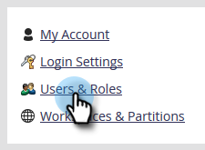
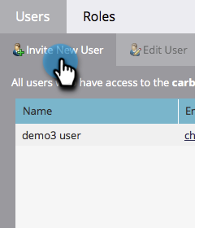
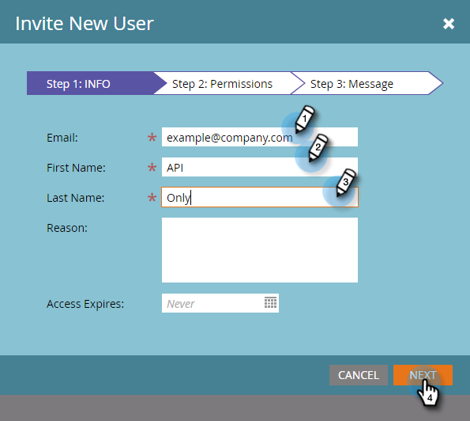
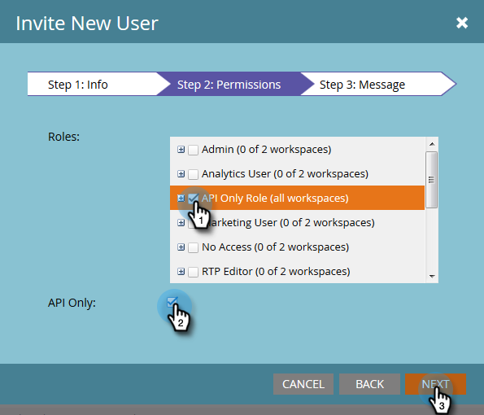
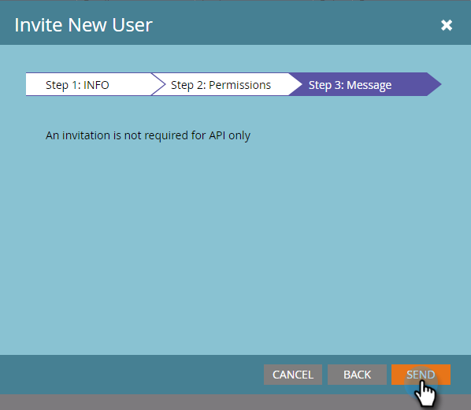

# Create an API Only User {#create-an-api-only-user}

If you want to integrate with Marketo via the [REST API](https://developers.marketo.com/documentation/rest/){target="_blank"}, you'll need to create an API only user. Here's how.

>[!IMPORTANT]
>
>If you're creating API Only users in a subscription that's been onboarded to Adobe Identity, your steps are different and [can be found here](/help/marketo/product-docs/administration/marketo-with-adobe-identity/add-api-only-user-for-adobe-ims-enabled-subscriptions.md){target="_blank"}.

>[!PREREQUISITES]
>
>[Create an API Only User Role](/help/marketo/product-docs/administration/users-and-roles/create-an-api-only-user-role.md){target="_blank"}

>[!NOTE]
>
>**Admin Permissions Required**

1. Go to the **[!UICONTROL Admin]** area.

   

1. Click **[!UICONTROL Users & Roles]**.

   

1. Click **[!UICONTROL Invite New User]**.

   

1. Enter an Email, First Name, and Last Name for the API only user. Click **[!UICONTROL Next]**.

   

   >[!TIP]
   >
   >Add an optional reason or an access expiration date. Access expiration dates are handy for short-term employees.

1. Select the **[!UICONTROL API Only]** role and check the **[!UICONTROL API Only]** checkbox. Click **[!UICONTROL Next]**.

   

1. Click **[!UICONTROL Send]**.

   

>[!NOTE]
>
>The pop-up says, "An invitation is not required for API only," but that doesn't mean you've done something wrong. It just means we will create the role without an invite email having to be sent.

Alrighty then! Now let's go ahead and create the custom service.

>[!MORELIKETHIS]
>
>[Create a Custom Service for Use with REST API](/help/marketo/product-docs/administration/additional-integrations/create-a-custom-service-for-use-with-rest-api.md){target="_blank"}
