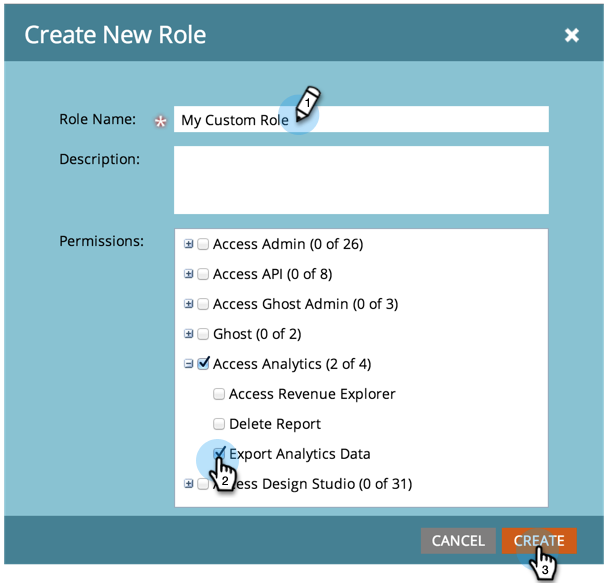
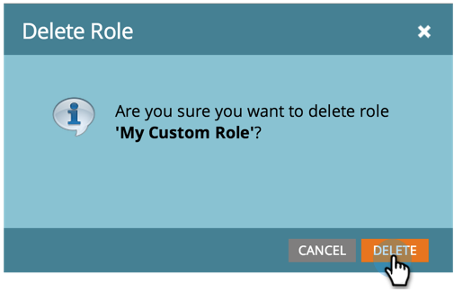
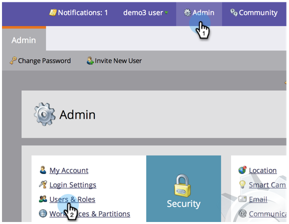
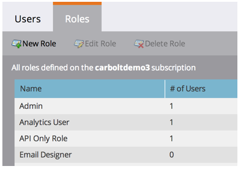
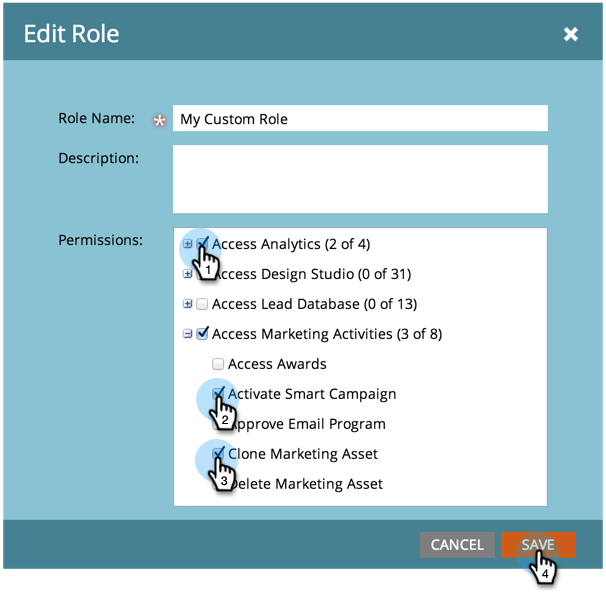
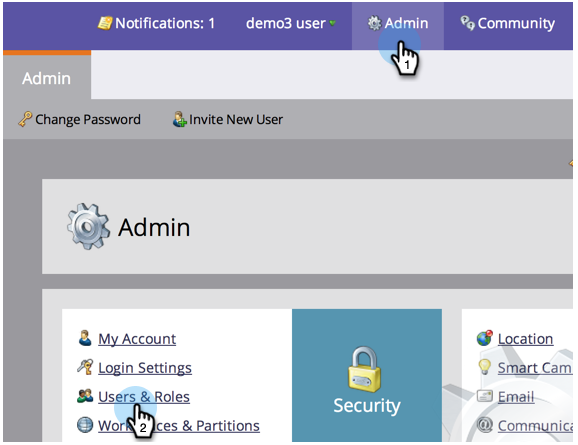
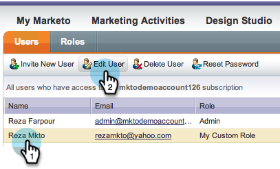

# Create, Delete, Edit and Change a User Role {#create-delete-edit-and-change-a-user-role}

**Roles** group together a bunch of permissions. **Permissions** allow you to do stuff in Marketo. You assign a **role** to a user. Easy as pie.

>[!NOTE]
>
>**Admin Permissions Required**

## Create a Role {#create-a-role}

1. Go to **Admin **and click **Users & Roles**.

   

1. Go to the** Roles tab** and click **New Role**.

   

1. Name your new role, check all the permissions you want to grant to users associated with the role, and click **Create**.

   

## Delete a Role {#delete-a-role}

1. Under Admin,** **click **Users & Roles**.

   

1. Under the **Roles **tab, select a role and click **Delete Role**.

   

1. Confirm the deletion by clicking **Delete**.

   

>[!NOTE]
>
>You must first ensure that no users are assigned to a role, otherwise it cannot be deleted.

## Edit an Existing Role {#edit-an-existing-role}

>[!NOTE]
>
>To edit your own user role, you'll have to log in as another user with Admin rights.

1. Go to **Admin** and click **Users & Roles**.

   

1. Click the **Roles **tab.

   

1. Select the role you want to edit and click** Edit Role**.

   

1. Make all the changes you need and click **Save**.

   

   >[!NOTE]
   >
   >The changes made to the role will affect every user associated to this role.

   >[!TIP]
   >
   >Are you looking to update the account email address? [Learn how here](http://docs.marketo.com/x/3wFI).

## Change a User's Role {#change-a-users-role}

1. Go to **Admin** and click **Users & Roles**.

   

1. Select the user you want to assign a different role to and click **Edit User.**

   

1. Uncheck the previous role, select the new one, then click **Save**.

   

>[!NOTE]
>
>If you leave multiple roles selected, Marketo will default to the most restrictive permission.

Awesome, now you are really are on a roll! &nbsp;(Get it?) 