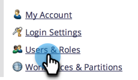

# Edit User Workspaces {#edit-user-workspaces}

1. Go to the **[!UICONTROL Admin]** area.

   

1. Click **[!UICONTROL Users & Roles]**.

   

1. Select the desired user and click **[!UICONTROL Edit User]**.

   

1. Make your desired changes and click **[!UICONTROL Save]**.

   
