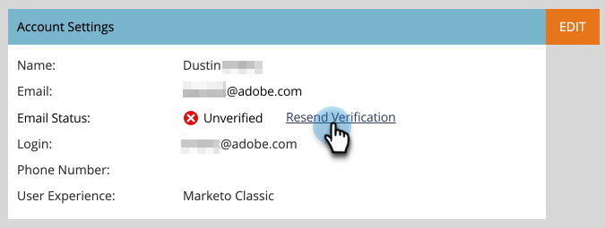
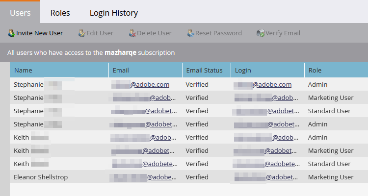

# Email Verification {#email-verification}

Adobe Marketo Engage subscriptions require all non-API only users, including Marketo Engage Administrators, to verify their email address. Single Sign-on (SSO) users who are not assigned an Admin role, or who are assigned a role with the 'Bypass SSO' permission, will automatically have their email verified when their subscription is enabled with the Email Verification feature.

**User Invite**

When an Admin invites a user, that user is automatically verified once they click the invite link. SSO users, not assigned the Admin role, are automatically verified.

**Changing an Email Address**

When a user's email address is changed, it becomes unverified. An email will be sent to them allowing them to re-verify. Users can manually resend that email by clicking **Resend Verification**.

   

   

**Users and Roles**

In Admin > Users & Roles, the Email Status column shows the verification status of every user.

   

To resend a verification email to an unverified user, simply select their record and click the **Verify Email** button.
