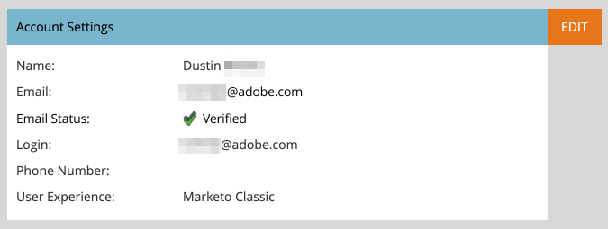

# Email Verification {#email-verification}

Adobe Marketo Engage subscriptions require all non-API only users, including Marketo Engage Administrators, to verify their email address. Single Sign-on (SSO) users who are not assigned an Admin role, or who are assigned a role with the 'Bypass SSO' permission, will automatically have their email verified when their subscription is enabled with the Email Verification feature.

## Why This Feature Was Introduced {#why-this-feature-was-introduced}

Marketo Engage is continuing the rollout of Email Verification in preparation for migrating customers to the Adobe Business Platform, including user migration to Adobe IDs. This feature enhances the security of existing Marketo Engage user accounts. To ensure a Marketo Engage user is associated with the proper Adobe ID, existing Marketo Engage users must verify their email address. A Marketo Engage user must have a verified email address to be migrated to an Adobe ID. If a Marketo Engage user does not verify their email address, they cannot be migrated to an Adobe ID and will lose access to a Marketo subscription after the user migration for the subscription is complete.

## User Invite {#user-invite}

When an Admin invites a user, that user is automatically verified once they click the invite link. SSO users, not assigned the Admin role, are automatically verified.

## Verification Email {#verification-email}

Users will receive the following email when email verification is activated for a subscription, or if it's triggered by an Admin/user:

   

>[!NOTE]
>
>To resend a verification email to an unverified user, simply select their record and click the **[!UICONTROL Verify Email]** button.

## Changing an Email Address {#changing-an-email-address}

When a user's email address is changed, it becomes unverified. An email will be sent to them allowing them to re-verify. Users can manually resend that email by clicking **[!UICONTROL Resend Verification]**.

   

   

## Users and Roles {#users-and-roles}

In **[!UICONTROL Admin]** > **[!UICONTROL Users & Roles]**, the Email Status column shows the verification status of every user.

   

## Multiple User Login IDs {#multiple-user-login-ids}

Only one user account can be associated with a single email address. If there are multiple user accounts associated with a single email address, Marketo Engage will require the conflict to be resolved and display all user logins associated with the email address, as well as three resolution options:

* Use the current email for the current User Login ID
* Use a new email for the current User Login ID
* Delay the decision until next login

   

>[!NOTE]
>
>While a user account has to be associated with a single address, a user account can be used across many subscriptions via Universal ID.
