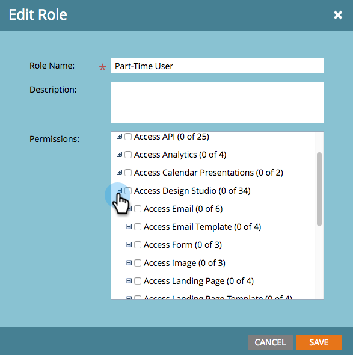

# Enable No-Draft for Snippets {#enable-no-draft-for-snippets}

No-Draft for Snippets allows you to distribute snippet changes without drafting approved assets using it. All assets using the edited snippet get the updates and maintain their respective statuses:

* Approved assets get the snippet updates and stay approved

* Drafts get the snippet updates and stay in draft mode

No-Draft is automatically enabled for all Administrator roles. An admin can then enable this feature for any additional role.

>[!NOTE]
>
>**Admin Permissions Required**

1. Go to the **[!UICONTROL Admin]** area.

   

1. Click **[!UICONTROL Users & Roles]**.

   

1. Go to the **[!UICONTROL Roles]** tab, select a role, then click **[!UICONTROL Edit Role]**.

   

1. Expand the **[!UICONTROL Access Design Studio]** option.

   

1. Expand the **[!UICONTROL Access Snippet]** option.

   

1. Expand the **[!UICONTROL Approve Snippet]** permission and check the **[!UICONTROL No-Draft]** box. Then click **[!UICONTROL Save]**.

   

>[!TIP]
>
>To disable No-Draft, follow steps 1-4 above, clear the No-Draft checkbox, and click **[!UICONTROL Save]**.

>[!MORELIKETHIS]
>
>[Approve a Snippet with No-Draft](/help/marketo/product-docs/personalization/segmentation-and-snippets/snippets/approve-a-snippet-with-no-draft.md){target="_blank"}
