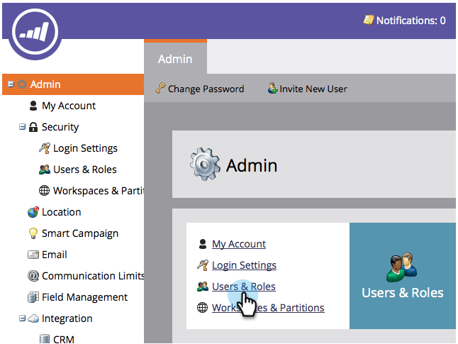
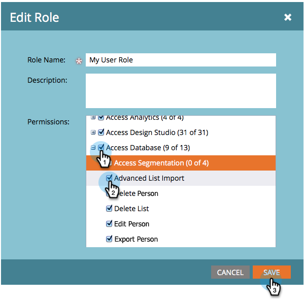

# Enable the Advanced List Import Permission on a Role {#enable-the-advanced-list-import-permission-on-a-role}

List Import Mode is only available for users with a role that has the Advanced List Import permission enabled. All other users won’t see the List Import Mode drop-down when importing a list of people and any list they import defaults to the Normal import mode.

>[!NOTE]
>
>**Admin Permissions Required**

1. Go to **Admin**.

   

1. Click **Users & Roles**.

   

1. Under the **Roles** tab, select the role you want to modify and click **Edit Role**.

   

1. Under Access Database, check **Advanced List Import** then click **Save**.

   

Cool! Now all users associated to the role you edited will have advanced list import options enabled.
