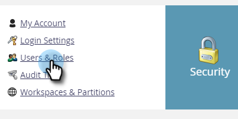
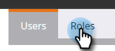
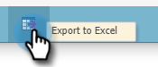
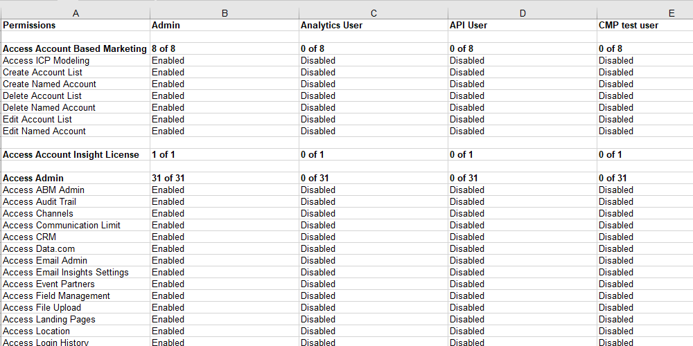

# Export Roles and Permissions {#export-roles-and-permissions}

Here's how to export all roles and their permissions.

>[!NOTE]
>
>Admin Permissions Required

1. In your My Marketo, click **Admin**.

   

1. Select **Users and Roles**.

   

1. Click the **Roles** tab.

   

1. Scroll to the bottom of the page and click the Export button.

   

>[!NOTE]
>
>Make sure your browser isn't blocking pop-ups from Marketo.

The data will export as a CSV and contain roles, permissions, and a count of how many permissions have been enabled per group.

   
