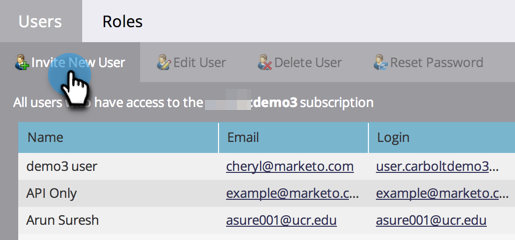
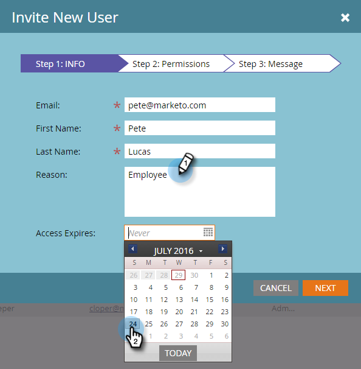
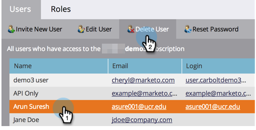
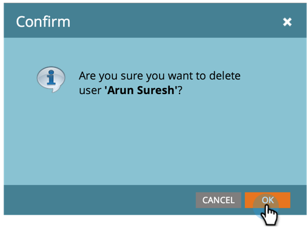
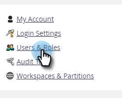
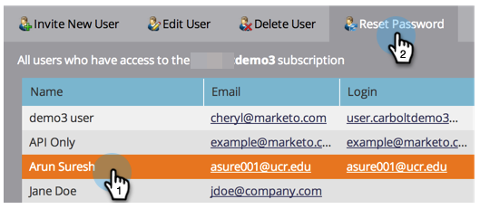
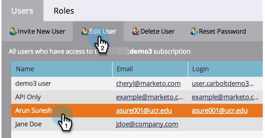

# Managing Marketo Users {#managing-marketo-users}

## Create Users {#create-users}

1. Go to the **[!UICONTROL Admin]** area.

   

1. Click **[!UICONTROL Users & Roles]**.

   

1. Click **[!UICONTROL Invite New User]**.

   

1. Enter the **[!UICONTROL Email]**, **[!UICONTROL First Name]**, and **[!UICONTROL Last Name]**.

   

1. Optionally, enter a reason for the invitation and select an expiration date in the **[!UICONTROL Access Expires]** field using the date picker.

   

1. Click **[!UICONTROL Next]**.

   

   >[!TIP]
   >
   >An expiration date is great for short-term external stakeholders or consultants who need Marketo access only for a brief time.

   >[!NOTE]
   >
   >When the expiration date arrives, the user receives an expiration notification and their account is locked.

1. Select the **[!UICONTROL Role]** of your choice and click **[!UICONTROL Next]**.

   

1. Make edits to the invitation message if necessary. Click **Se[!UICONTROL ]nd**.

   

   >[!NOTE]
   >
   >The email/login needs to be unique; if you've already used it in a sandbox instance, you will need to use a different one in production and vice versa.

   

   >[!NOTE]
   >
   >Invitations expire three days after a new user is added.

The new user is now listed in the Users tab and will receive an email with instructions on how to activate their account.

## Delete Users {#delete-users}

1. Go to the **[!UICONTROL Admin]** area.

   

1. Click **[!UICONTROL Users & Roles]**.

   

1. Select the user you want to remove and click **[!UICONTROL Delete User]**.

   

1. Confirm by clicking **[!UICONTROL OK]**.

   

## Reset User Passwords {#reset-user-passwords}

1. Go to the **[!UICONTROL Admin]** area.

   

1. Click **[!UICONTROL Users & Roles]**.

   

1. Select a user and click **[!UICONTROL Reset Password]**.

   

1. Click **[!UICONTROL Close]** to dismiss the prompt.

   

The user will receive an email with password reset instructions.

>[!TIP]
>
>If the user doesn't see the email in their inbox, ask them to check their junk/spam folder.

## Change Permissions and Edit User Information {#change-permissions-and-edit-user-information}

1. Go to the **[!UICONTROL Admin]** area.

   

1. Click **[!UICONTROL Users & Roles]**.

   

1. Select a user and click **[!UICONTROL Edit User]**.

   

1. You can edit user information and change the associated role. Click **[!UICONTROL Save]**.

   

>[!CAUTION]
>
>If you are the only Admin in Marketo, be sure not to remove your own admin rights.

>[!NOTE]
>
>If a new user is invited as an Admin, or if an Admin is deleted, all current Admins will receive an email notification.

Awesome work! You now know how to create a user, delete a user, reset a user's password, and edit users.
