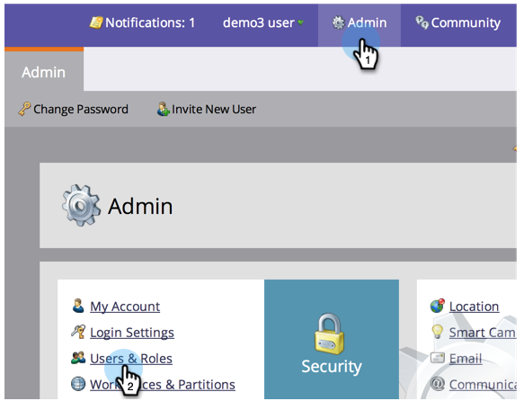
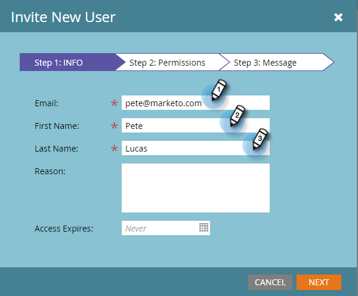
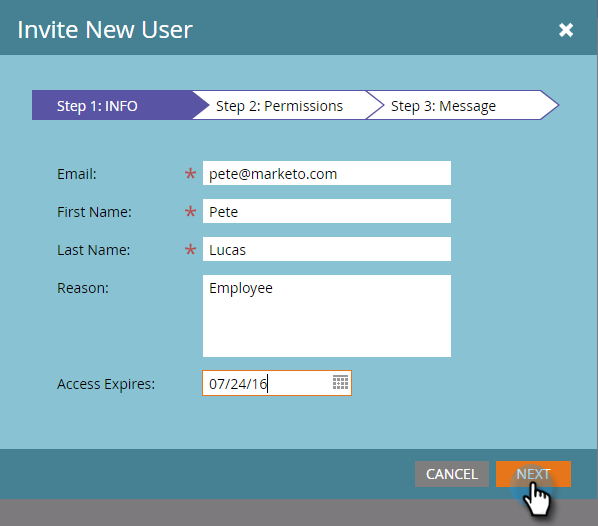
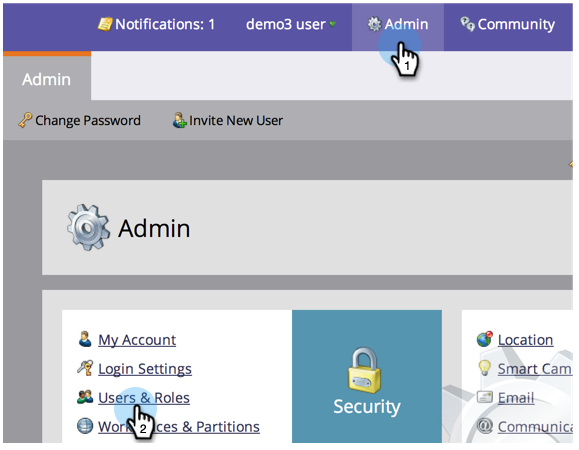
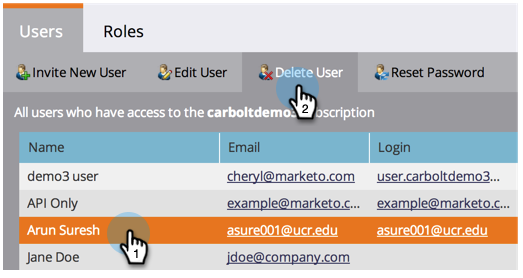
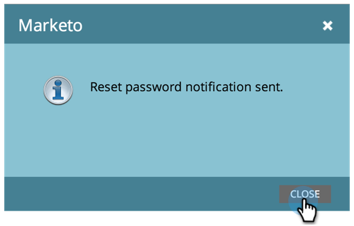
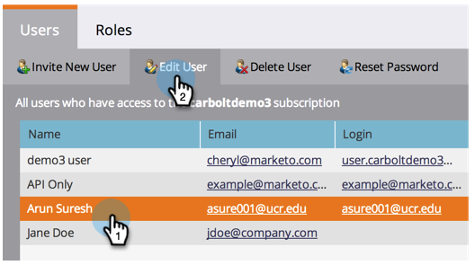

# Managing Marketo Users {#managing-marketo-users}

## Create Users {#create-users}

1. Go to **Admin** and click **Users & Roles**.

   

1. Click **Invite New User**.

   

1. Enter the **Email address**, **First Name**, and **Last Name. **

   ** 

   **

1. Optionally, enter a reason for the invitation and select an expiration date in the **Access Expires** field using the date picker.

   

1. Click **Next**.

   

   >[!TIP]
   >
   >An expiration date is great for short-term external stakeholders or consultants who need Marketo access only for a brief time.

   >[!NOTE]
   >
   >When the expiration date arrives, the user receives an expiration notification and their account is locked.

1. Select the **Role **of your choice and click **Next**.

   

1. Make edits to the invitation message if necessary. Click **Send**.

   

   >[!NOTE]
   >
   >The email/login needs to be unique; if you've already used it in a sandbox instance, you will need to use a different one in production and vice versa.

   

   >[!NOTE]
   >
   >Invitations expire three days after a new user is added.

The new user is now listed in the Users tab and will receive an email with instructions on how to activate their account. 

## Delete Users {#delete-users}

##### 1. Go to Admin and click Users & Roles. {#go-to-admin-and-click-users-roles}

2. Select the user you want to remove and click Delete User.

3. Confirm by clicking OK.

 

## Reset User Passwords {#reset-user-passwords}

##### 1. Go to Admin and click Users & Roles. {#go-to-admin-and-click-users-roles-1}

2. Select a user and click Reset Password.

3. Click Close to dismiss the prompt.

The user will receive an email with password reset instructions.

>[!TIP]
>
>If the user doesn't see the email in their inbox, ask them to check their junk/spam folder.

## Change Permissions and Edit User Information {#change-permissions-and-edit-user-information}

1. Go to **Admin** and click **Users & Roles.**

   

1. Select a user and click **Edit User**.

   

1. You can edit user information and change the associated role. Click **Save**.

   

>[!CAUTION]
>
>If you are the only Admin in Marketo, be sure not to remove your own admin rights.

>[!NOTE]
>
>If a new user is invited as an Admin, or if an Admin is deleted, all current Admins will receive an email notification.

Awesome work! You now know how to create a user, delete a user, reset a user's password, and edit users.
