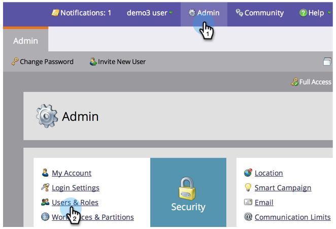
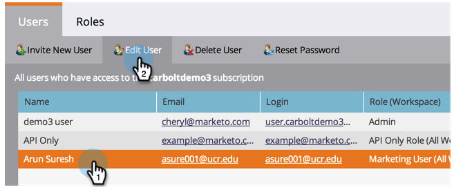
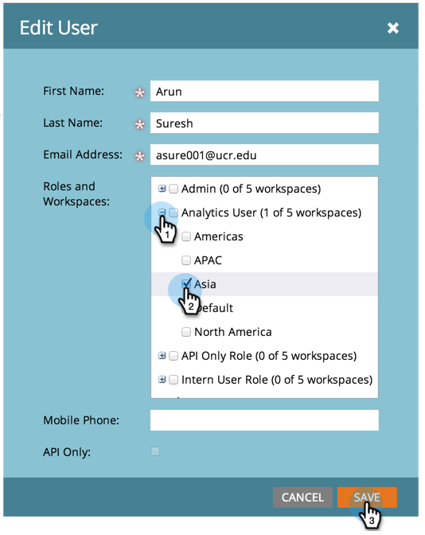
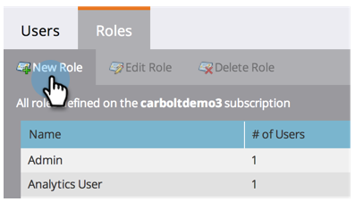
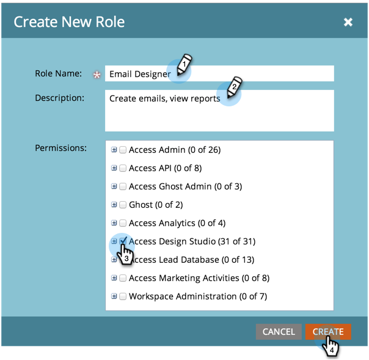
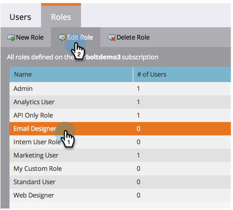
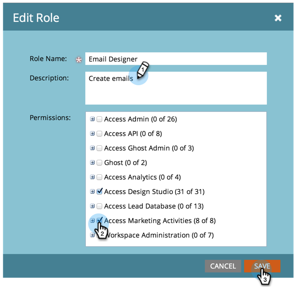
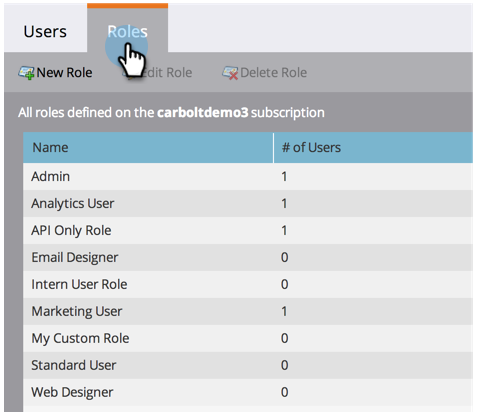
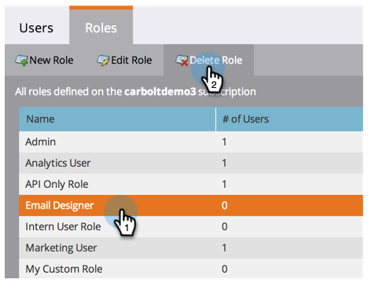
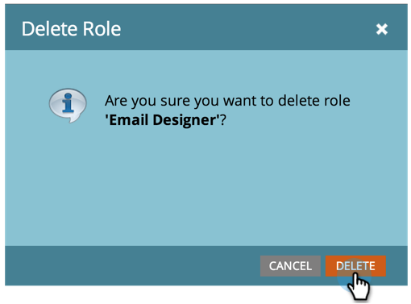

# Managing User Roles and Permissions {#managing-user-roles-and-permissions}

Set, create, and edit user roles and assign them to users. This allows you to control the areas and functionality that each Marketo user has access to.

For example, a marketing user typically needs broad access across the application, to create, modify, and deploy emails, landing pages, and programs. A web designer, on the other hand, spends almost all their time in the Design Studio, creating assets for use in emails and landing pages. And while company leaders make extensive use of Marketo’s reports in the Analytics area, they may not need to create or drive the assets or programs themselves.

>[!NOTE]
>
>**Admin Permissions Required**

Marketo provides several built-in roles, with different levels of access:

* **Admin** - all parts of the application, including the Admin section
* **Standard User** - all parts of the application, except the Admin section
* **Marketing User** - all parts of the application, except the Admin section
* **Web Designer** - only the Design Studio
* **Analytics User** - only the Analytics section

You cannot edit the Admin and Standard User roles, but you can edit the others. You can also create new custom roles to match the particular organizational structures in your company.

## Assign Roles to a User {#assign-roles-to-a-user}

You can assign roles to a user when you [create users for the first time](/help/marketo/product-docs/administration/users-and-roles/create-delete-edit-and-change-a-user-role.md) or by [editing an existing user](/help/marketo/product-docs/administration/users-and-roles/managing-marketo-users.md).

1. To edit an existing user, go to **Admin** and click **Users & Roles**.

   

1. From the list, select the user you wish to edit and click **Edit User**.

   

1. Under **Roles**, select the roles you want to assign to the user, based on the permissions they need, and click **Save**.

   

   >[!NOTE]
   >
   >To learn about each role, see  [Descriptions of Role Permissions](/help/marketo/product-docs/administration/users-and-roles/managing-user-roles-and-permissions/descriptions-of-role-permissions.md).

## Create a New Role {#create-a-new-role}

Sometimes, your organization has employees in very specific roles that require a custom combination of permissions.  

1. To create a new user role, go to Admin and click **Users & Roles**.

   

1. Click the **Roles** tab.

   

1. Click **New Role**.

   

1. Enter a **Role Name**, a **Description** (optional), and select the permissions that users in this role will need.

   

## Edit a Role {#edit-a-role}

If you need to change the permissions that are associated with an existing role, you can edit the role.

1. Go to **Admin** and click **Users & Roles**.

   

1. Click the **Roles** tab.

   

1. From the list, select the role you wish to modify and click **Edit Role**.

   

1. Change the **Role Name** and **Description** if necessary, and then change the selection of associated **Permissions**.

   

   >[!NOTE]
   >
   >Users who have the role you edited will receive the modified permissions after they log out and back in again.

## Delete a Role {#delete-a-role}

If a role becomes unnecessary, you can delete it.  

1. Go to Admin and click **Users & Roles**.

   

1. Click the **Roles** tab.

   

1. From the list, select the role you want to delete and click **Delete Role**.

   

1. Click **Delete** to confirm.

   
