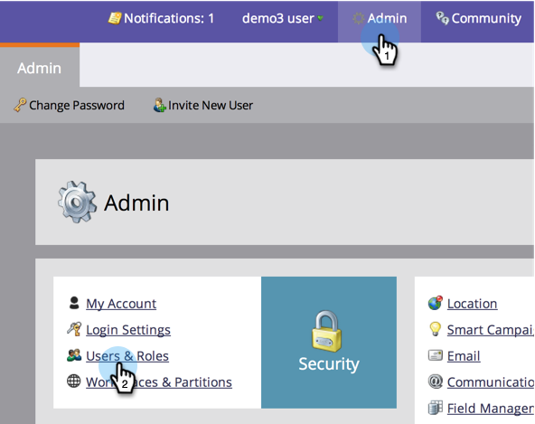

# Allow User Access to a Workspace {#allow-user-access-to-a-workspace}

Workspaces can be for any reason (such as business unit or&nbsp;geography separation). They separate the assets (smart lists, programs, etc.) of each team. Here's how to give a user access to one or more workspaces.

>[!NOTE]
>
>**Admin Permissions Required**

>[!NOTE]
>
>**Deep Dive**
>
>Learn more about&nbsp; [workspaces](understanding-workspaces-and-person-partitions.md).

1. Under&nbsp;Admin, click&nbsp;Users & Roles.

1. Under the **Users **tab, select the user and click **Edit User**.

   

1. Select the **Role and Workspace** you want the user to have access to.

   >[!NOTE]
   >
   >You can allow your users to have any combination of access to workspaces.

   

1. After saving the changes, you should see the update!

   

   Great! Now when they log in, they will see all of the workspaces you gave them access to.

