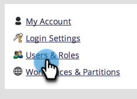
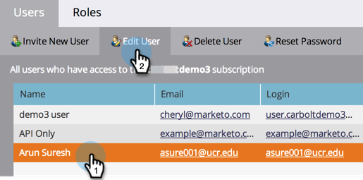
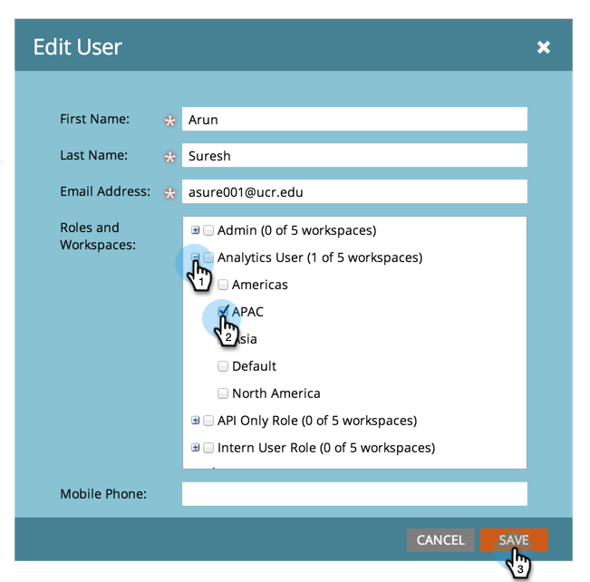
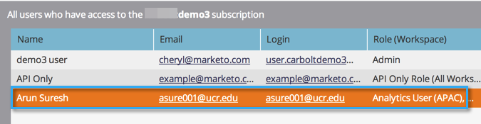

# Allow User Access to a Workspace {#allow-user-access-to-a-workspace}

Workspaces can be for any reason (such as business unit or geography separation). They separate the assets (smart lists, programs, etc.) of each team. Here's how to give a user access to one or more workspaces.

>[!NOTE]
>
>**Admin Permissions Required**

>[!NOTE]
>
>Learn more about [workspaces](/help/marketo/product-docs/administration/workspaces-and-person-partitions/understanding-workspaces-and-person-partitions.md).

1. Go to the **Admin** area.

    

1. Click **Users & Roles**.

   

1. Under the **Users** tab, select the user and click **Edit User**.

   

1. Select the **Role and Workspace** you want the user to have access to.

   

   >[!NOTE]
   >
   >You can allow your users to have any combination of access to workspaces.

After saving the changes, you should see the update!

   

