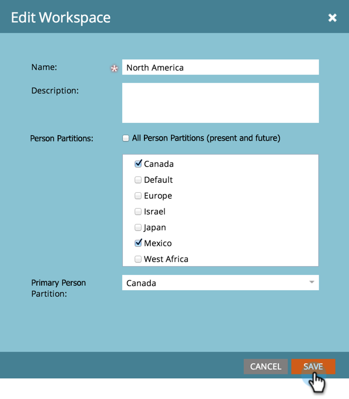

# Assign Person Partitions to Workspaces {#assign-person-partitions-to-workspaces}

Here's how to edit the person partition / workspace assignments:

>[!NOTE]
>
>**Admin Permissions Required**

>[!PREREQUISITES]
>
>[Create a New Workspace](/help/marketo/product-docs/administration/workspaces-and-person-partitions/create-a-new-workspace.md){target="_blank"}

>[!CAUTION]
>
>Workspaces and Person Partitions can be complex. Please contact  [Marketo support](https://nation.marketo.com/t5/Support/ct-p/Support){target="_blank"} for help in setting them up.

1. Go to the **[!UICONTROL Admin]** area. 

   

1. Click **[!UICONTROL Workspaces & Partitions]**.

   

1. Select your workspace and click **[!UICONTROL Edit Workspace]**.

   

1. Edit the person partition information you want to change.

   

   >[!NOTE]
   >
   >* The "[!UICONTROL All Person Partitions]" checkbox indicates that this workspace has access to all person partitions in the system.
   >
   >* Primary person partitions are the default where all peoples will be entered. Use [flow steps](/help/marketo/product-docs/core-marketo-concepts/smart-campaigns/flow-actions/use-add-choice-in-a-flow-step.md) or [assignment rules](/help/marketo/product-docs/administration/workspaces-and-person-partitions/assigning-person-partitions-with-assignment-rules.md){target="_blank"} to move people around.

1. Click **[!UICONTROL Save]**.

   

After saving, you should see the changes.

   

You have successfully edited your workspace!

>[!MORELIKETHIS]
>
>[Understanding Workspaces and Person Partitions](/help/marketo/product-docs/administration/workspaces-and-person-partitions/understanding-workspaces-and-person-partitions.md){target="_blank"}.
