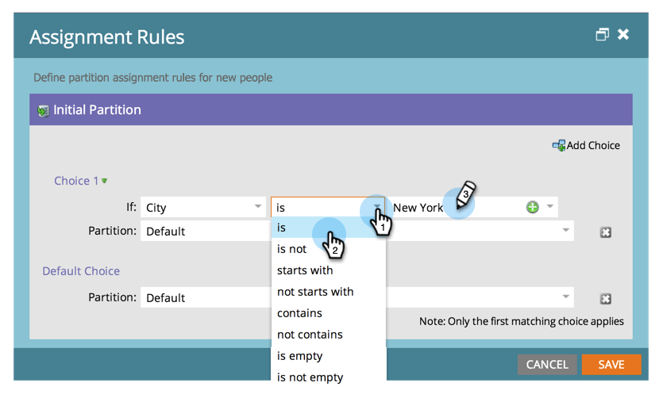

# Assigning Person Partitions with Assignment Rules {#assigning-person-partitions-with-assignment-rules}

>[!NOTE]
>
>**Admin Permissions Required**

>[!PREREQUISITES]
>
>[Create a Person Partition](/help/marketo/product-docs/administration/workspaces-and-person-partitions/create-a-person-partition.md)

When using person partitions, set up assignment rules to route people created from your CRM to their respective partitions.

>[!NOTE]
>
>Only people created in Marketo from your CRM and via the SOAP API will have assignment rules applied to them.

1. Go to the **Admin** area. 

   

1. Click **Workspaces & Partitions**.

   

1. Under the **People Partitions** tab, click **Assignment Rules**.

   

1. Click **Add Choice** to add conditions for routing people into person partitions.

   

1. Select the field the condition should be built on.  

   

1. Choose the choice operator and enter a value.

   

1. Select the People Partition you want the people that meet the conditions to fall into.

   

   >[!NOTE]
   >
   >You can add as many choices as you like.

1. Click **Save**.

   

And there you have it! You have assigned rules for filling your person partitions with people!

>[!NOTE]
>
>The Default Choice will be applied if none of the previous conditions are met.
