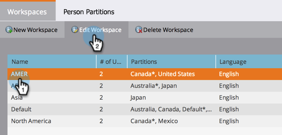
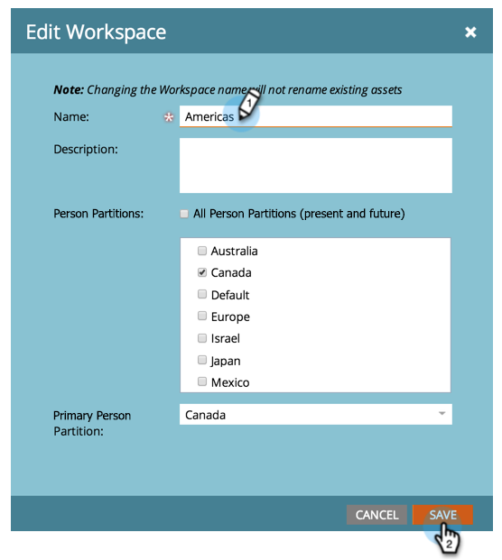

# Change the Name of a Workspace {#change-the-name-of-a-workspace}

>[!NOTE]
>
>**FYI**
>
>Marketo is now standardizing language across all subscriptions, so you may see lead/leads in your subscription and person/people in docs.marketo.com. These terms mean the same thing; it does not affect article instructions. There are some other changes, too. [Learn more](http://docs.marketo.com/display/DOCS/Updates+to+Marketo+Terminology).

>[!NOTE]
>
>**Admin Permissions Required**

>[!NOTE]
>
>**Prerequisites**
>
>[Create a New Workspace](create-a-new-workspace.md)

Users can change the name of a workspace. It's pretty simple. 

>[!NOTE]
>
>**Deep Dive**
>
>Understand first with [Understanding Workspaces and Person Partitions](understanding-workspaces-and-person-partitions.md).

1. Under **Admin**, click on **Workspaces & Partitions.**

   

1. Select the Workspace and click **Edit Workspace**.

   

1. Enter a new **Name** for your Workspace and click **Save.**

   

1. After saving, your should see the changes!

   

