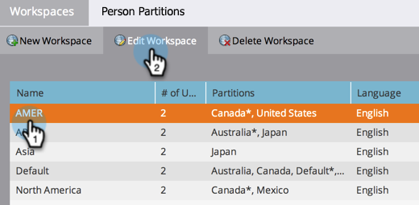

# Change the Name of a Workspace {#change-the-name-of-a-workspace}

>[!NOTE]
>
>**Admin Permissions Required**

>[!PREREQUISITES]
>
>[Create a New Workspace](/help/marketo/product-docs/administration/workspaces-and-person-partitions/create-a-new-workspace.md)

Users can change the name of a workspace. It's pretty simple.

>[!NOTE]
>
>Understand first with [Understanding Workspaces and Person Partitions](/help/marketo/product-docs/administration/workspaces-and-person-partitions/understanding-workspaces-and-person-partitions.md).

1. Go to the **Admin** area. 

   

1. Click **Workspaces & Partitions**.

   

1. Select the Workspace and click **Edit Workspace**.

   

1. Enter a new **Name** for your Workspace and click **Save.**

   

After saving, you should see the changes.

   
