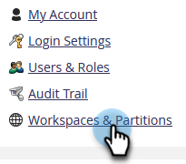
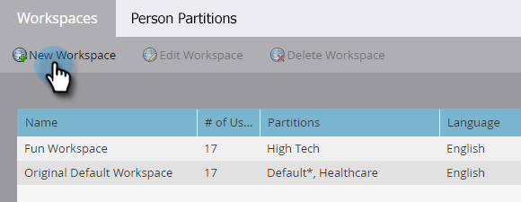
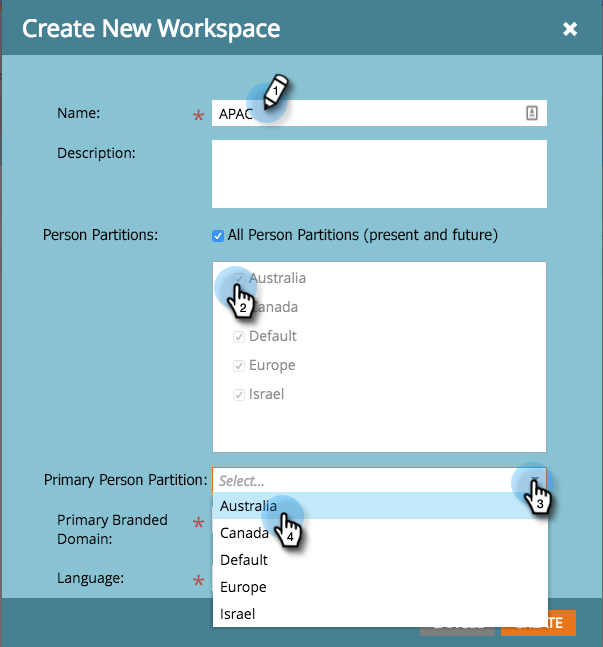
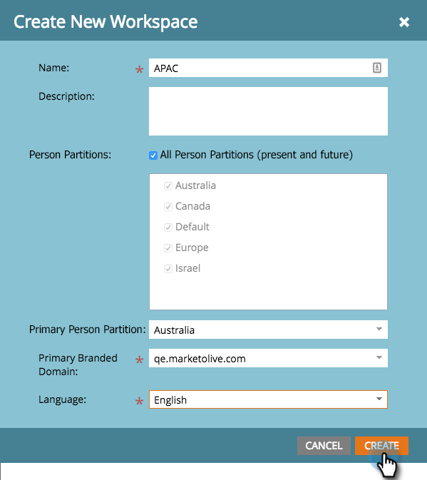
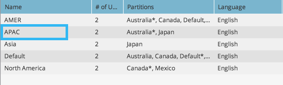

# Create a New Workspace {#create-a-new-workspace}

Workspaces are useful for subdividing your company. Reasons for setting up workspaces include:

* Geography: Europe Marketing Operations vs. North America Marketing Operations
* Business Unit A vs. Business Unit B

Here's how to create a new workspace.

>[!NOTE]
>
>**Admin Permissions Required**

>[!NOTE]
>
>Understand first with [Understanding Workspaces and Person Partitions](/help/marketo/product-docs/administration/workspaces-and-person-partitions/understanding-workspaces-and-person-partitions.md){target="_blank"}.

>[!TIP]
>
>To learn more about Workspace best practices, please contact [Marketo Professional Services](https://business.adobe.com/products/marketo/services-support.html){target="_blank"}.

1. Go to the **[!UICONTROL Admin]** area. 

   

1. Click **[!UICONTROL Workspaces & Partitions]**.

   

1. Click **[!UICONTROL New Workspace]**.

   

1. Enter a **[!UICONTROL Name]**, and select the **[!UICONTROL Person Partitions]** you want to use. Choose a **[!UICONTROL Primary Person Partition]**. Make sure to [create person partitions](/help/marketo/product-docs/administration/workspaces-and-person-partitions/create-a-person-partition.md){target="_blank"} if you haven't already.

   

   >[!NOTE]
   >
   >* The **[!UICONTROL All Person Partitions]** checkbox means that this workspace can use all person partitions in the system.
   >
   >* The **[!UICONTROL Primary Person Partition]** acts as the default and is where all people will be assigned.

   >[!IMPORTANT]
   >
   >If you enabled multiple branded domains, you must choose a primary branded domain.

1. Select the workspace language.

   

   >[!NOTE]
   >
   >Upon creation, Marketo will seed sample assets in the workspace. Language allows those seeded objects to be in a non-English language.

1. Click **[!UICONTROL Create]**.

   

Create as many workspaces as you need and assign the appropriate person partition(s) to them.

After creating your workspace, you should see the update.

   
