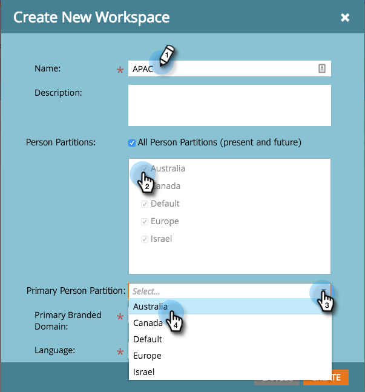
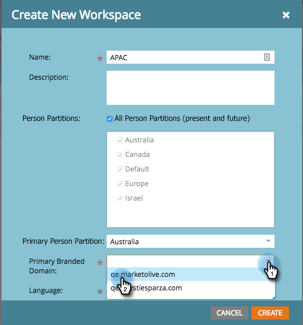
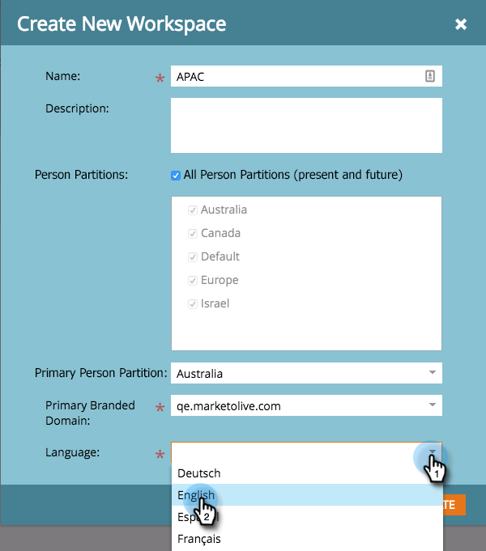

# Create a New Workspace {#create-a-new-workspace}

Workspaces are useful for subdividing your company. Reasons for setting up workspaces include:

* Geography: Europe Marketing Operations vs. North America Marketing Operations
* Business Unit A vs. Business Unit B

Here's how to create a new workspace.

>[!NOTE]
>
>**Admin Permissions Required**

>[!NOTE]
>
>Understand first with [Understanding Workspaces and Person Partitions](/help/marketo/product-docs/administration/workspaces-and-person-partitions/understanding-workspaces-and-person-partitions.md).

>[!NOTE]
>
>To learn more about Workspace best practices, please contact [Marketo Professional Services](mailto:services@marketo.com).

1. Under **[!UICONTROL Admin]**, click on **[!UICONTROL Workspaces & Partitions]**.

   

1. Click on **[!UICONTROL New Workspace]**.

   

1. Enter a **[!UICONTROL Name]**, and select the **[!UICONTROL Person Partitions]** you want to use. Choose a **[!UICONTROL Primary Person Partition]**.

   >[!NOTE]
   >
   >Make sure to [create person partitions](/help/marketo/product-docs/administration/workspaces-and-person-partitions/create-a-person-partition.md) if you haven't already.

   

   >[!NOTE]
   >
   >The **All Person Partitions** checkbox means that this workspace can use all person partitions in the system.
   >
   >The **primary person partition** acts as the default and is where all people will be assigned.

   If you enabled multiple branded domains, you must choose a primary branded domain.

   

1. Select the workspace language.

   >[!NOTE]
   >
   >Upon creation, Marketo will seed sample assets in the workspace. Language allows those seeded objects to be in a non-English language.

   

1. Click **[!UICONTROL Create]**.

   

   Create as many workspaces as you need and assign the appropriate person partition(s) to them.

   After creating your workspace, you should see the update!

   
