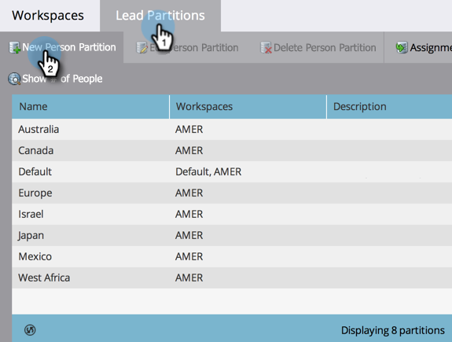
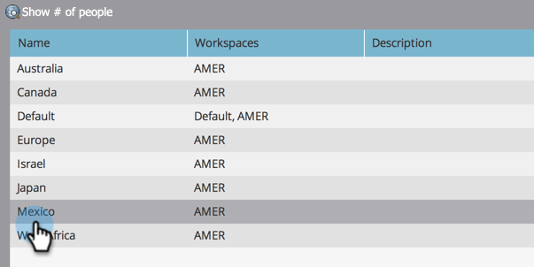

# Create a Person Partition {#create-a-person-partition}

Create a new person partition following these steps.

>[!NOTE]
>
>**Admin Permissions Required**

>[!NOTE]
>
>Understand first with [Understanding Workspaces and Person Partitions](/help/marketo/product-docs/administration/workspaces-and-person-partitions/understanding-workspaces-and-person-partitions.md).

1. Go to the **Admin** area. 

   

1. Click **Workspaces & Partitions**.

   

1. Go to the **Person Partitions** tab and click **New Person Partition**.  

   

1. Name your partition, choose the **Workspace(s)** where it will appear, and click **Create**.

   

After creating the partition, you should see the update.

   
