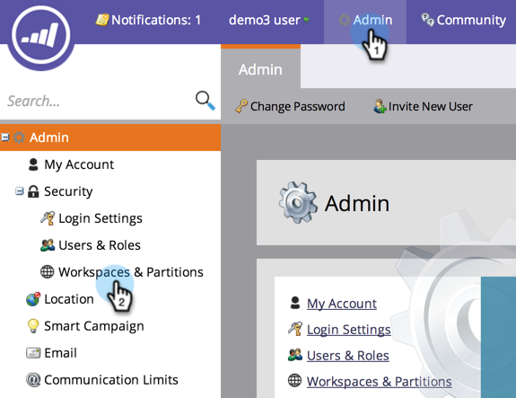
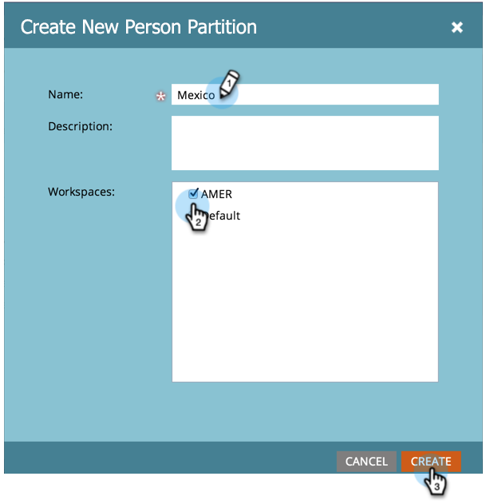

# Create a Person Partition {#create-a-person-partition}

Create a new person partition following these steps.

>[!NOTE]
>
>**FYI**
>
>Marketo is now standardizing language across all subscriptions, so you may see lead/leads in your subscription and person/people in docs.marketo.com. These terms mean the same thing; it does not affect article instructions. There are some other changes, too. [Learn more](http://docs.marketo.com/display/DOCS/Updates+to+Marketo+Terminology).

>[!NOTE]
>
>**Admin Permissions Required**

>[!NOTE]
>
>**Deep Dive**
>
>Understand first with [Understanding Workspaces and Person Partitions](understanding-workspaces-and-person-partitions.md).

>[!CAUTION]
>
>Person Partitions can be complex. Please contact&nbsp; [Marketo support](http://support.marketo.com/)&nbsp;for help setting them up.&nbsp;

##### 1. Under Admin, select Workspaces & Partitions. {#under-admin-select-workspaces-partitions}

1. Go to the **Person Partitions** tab and click **New Person Partition**.  

   

1. Name your partition, choose the **Workspace(s) **where it will appear, and click** Create.** 

   

   After creating the partition, you should see the update.

   

   There you have it! You now know how to create a Person Partition.

