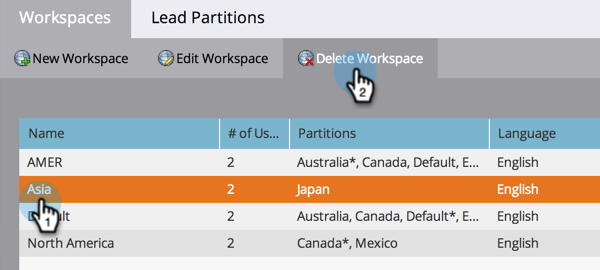
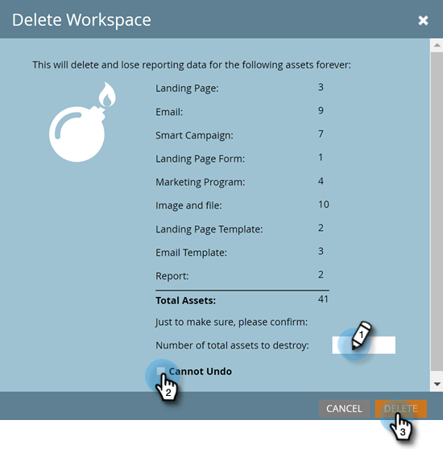

# Delete a Workspace {#delete-a-workspace}

>[!NOTE]
>
>**Admin Permissions Required**

>[!NOTE]
>
>You are not able to delete the Default workspace in Marketo.

1. Go to the **[!UICONTROL Admin]** area. 

   

1. Click **[!UICONTROL Workspaces & Partitions]**.

   

1. Select a workspace and click **[!UICONTROL Delete Workspace]**.

   

1. Confirm the number of assets you're about to delete (it's listed for you next to "[!UICONTROL total assets]"), select the **[!UICONTROL Cannot Undo]** checkbox, then click **[!UICONTROL Delete]**.

   
