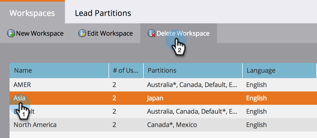
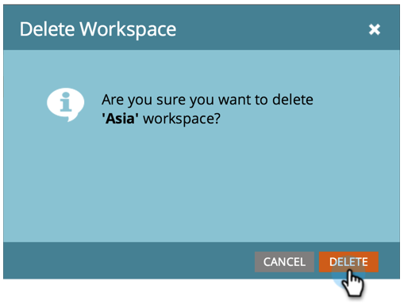

# Delete a Workspace {#delete-a-workspace}

>[!NOTE]
>
>**Admin Permissions Required**

>[!NOTE]
>
>You are not able to delete the Default workspace in Marketo.

##### 1. Under Admin, click Workspaces & Partitions. {#under-admin-click-workspaces-partitions}

  

##### 2. Select a workspace and click Delete Workspace.  {#select-a-workspace-and-click-delete-workspace}

>[!NOTE]
>
>**Reminder**
>
>IMPORTANT:&nbsp;Don't forget, all assets under the workspace must be deleted first.

##### 3. Click Delete to confirm. {#click-delete-to-confirm}

