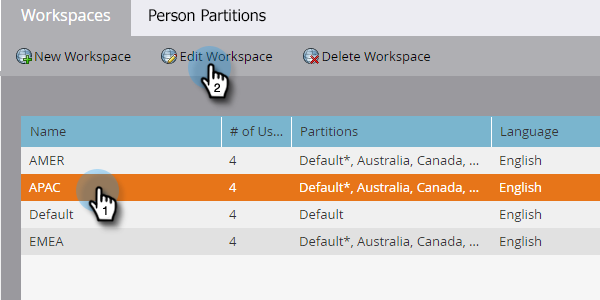
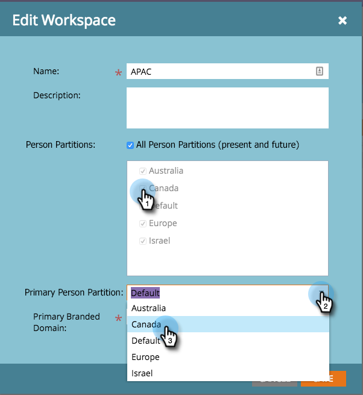

# Edit a Workspace {#edit-a-workspace}

Sometimes you need to make changes in a Workspace. It's easy.

>[!NOTE]
>
>**Admin Permissions Required**

>[!NOTE]
>
>Brush up on workspaces with [Understanding Workspaces and Person Partitions](/help/marketo/product-docs/administration/workspaces-and-person-partitions/understanding-workspaces-and-person-partitions.md){target="_blank"}.

1. Go to the **[!UICONTROL Admin]** area. 

   

1. Click **[!UICONTROL Workspaces & Partitions]**.

   

1. Select the workspace you want to edit and click **[!UICONTROL Edit Workspace]**.

   

1. You can select a different lead partition and choose a different primary person partition from the drop-down.

   >[!NOTE]
   >
   >You can [create more person partitions](/help/marketo/product-docs/administration/workspaces-and-person-partitions/create-a-person-partition.md){target="_blank"} if you need them.

   

   >[!NOTE]
   >
   >The **[!UICONTROL All Person Partitions]** checkbox means that this workspace can use all lead partitions in the system.

   >[!NOTE]
   >
   >The **[!UICONTROL Primary Person Partition]** acts as the default and is where all people will be assigned.

   If you enabled multiple branded domains, you can change to a different primary branded domain. Click **[!UICONTROL Save]**.

   

   >[!NOTE]
   >
   >You can't change the workspace language.

>[!MORELIKETHIS]
>
>* [Create a New Workspace](/help/marketo/product-docs/administration/workspaces-and-person-partitions/create-a-new-workspace.md){target="_blank"}
>* [Understanding Workspaces and Person Partitions](/help/marketo/product-docs/administration/workspaces-and-person-partitions/understanding-workspaces-and-person-partitions.md){target="_blank"}
