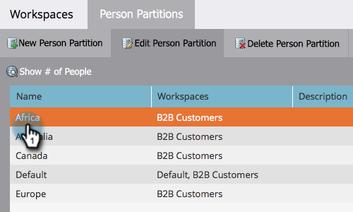

# Edit an Existing Person Partition {#edit-an-existing-person-partition}

A person partition is like having a second (or third) database. A partition can be hooked up to one or more workspaces. Here's how to edit the partition details.

>[!NOTE]
>
>**Admin Permissions Required**

>[!PREREQUISITES]
>
>[Create a Person Partition](/help/marketo/product-docs/administration/workspaces-and-person-partitions/create-a-person-partition.md)

1. Go to the **Admin** area. 

   

1. Click **Workspaces & Partitions**.

   

1. Under the **Person Partitions** tab, select the person partition you want to edit and click on **Edit Person Partition**.

   

1. Enter the Person Partition **Name**, the **Workspaces** they belong to, and click **Save**.

   

1. After saving the changes, you should see the update!

   
