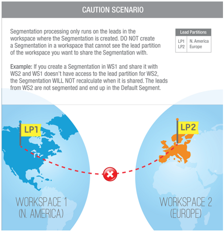
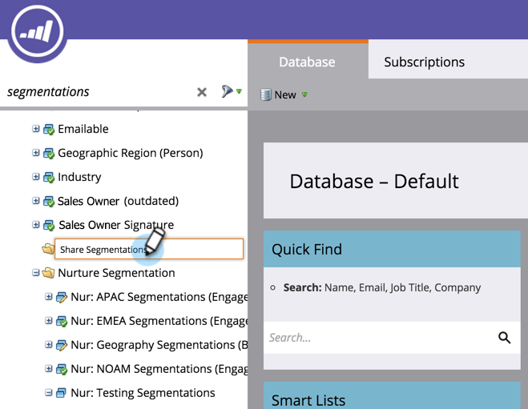
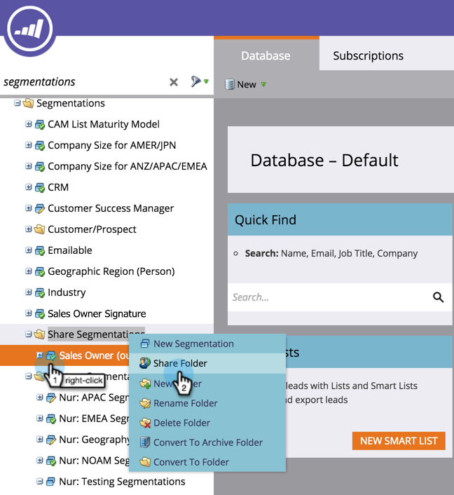

# Share Segmentations Across Workspaces and Partitions {#share-segmentations-across-workspaces-and-partitions}

>[!PREREQUISITES]
>
>This article is only for customers who have Workspaces and Partitions.

## What's a segmentation? {#whats-a-segmentation}

Marketo is great at picking out just the right people for a program or smart campaign. However, for more permanent personas, you should use segmentations. They are needed to use advanced dynamic content in Marketo.

>[!NOTE]
>
>Learn [how to create segmentations](/help/marketo/product-docs/personalization/segmentation-and-snippets/segmentation/create-a-segmentation.md).

Once you have these personas set up (_and_ you use workspaces), you will want to share them across your workspaces. Here are some good things to know:  

## Rules & Tips {#rules-tips}

* Each Marketo subscription can contain up to 20 Segmentations "total" across multiple workspaces (**not 20 per workspace**).
* You can only share a Segmentation with workspaces that you have access to.
* Make sure to create and utilize a **Default workspace that has visibility into all partitions**.

* Segmentation processing only runs on the people in the workspace where the Segmentation is created.

  * Create the Segmentation you want to share inside the Default Workspace.
    * Approve the Segmentation
    * The shared workspace sees a locked folder and the Segmentation is read-only.
    * The shared version cannot be edited. You can only edit the original Segmentation where it was created.

  * When you click on a Segment (e.g. Healthcare) within a shared Segmentation, the people you see will only be people in the partition associated with the workspace you are viewing.
    * If you create a Segmentation in Workspace 1 (WS1) and share it with WS2 and WS1 doesn't have access to the partition for WS2, it WILL NOT recalculate the Segmentation.
    * If you create a Segmentation in a workspace that has limited partitions, and then share it with another workspace, that workspace that received the shared Segmentation will only see people if they have overlap.

>[!NOTE]
>
>Some of these rules are a little complex. The easiest way to get started is to test with specific people. You can always make new segmentations and get rid of the old ones.

## Example Scenarios {#example-scenarios}

## Share a Segmentation {#share-a-segmentation}

1. Go to the **Database**.

   

1. Right-click **Segmentations** and select **New Folders**.

   

1. Name the folder you are going to share across workspaces (example: Share Segmentations).

   

1. Move the Segmentation(s) you want to share into the folder.

   

1. Right-click the folder and select **Share Folder**.

   

1. Select the workspace(s) you want to share the folder with. Click **Save**.

   

   >[!NOTE]
   >
   >The dialog displays the workspaces you have permission to view, which is why Marketo recommends creating and sharing Segmentations from the Default workspace that has visibility into all workspaces and partitions.

The originating folder displays in the Database tree with an arrow indicating that it is shared with other workspaces. From within the shared workspace, the folder displays with a lock to indicate that the contents of the folder have been shared from another workspace and are read-only.
