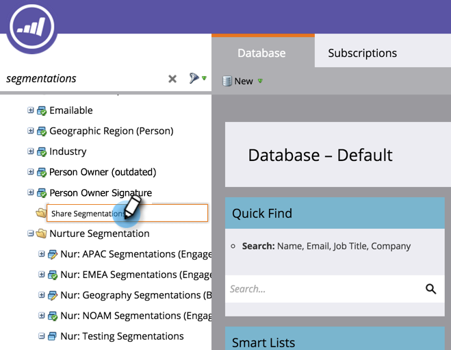
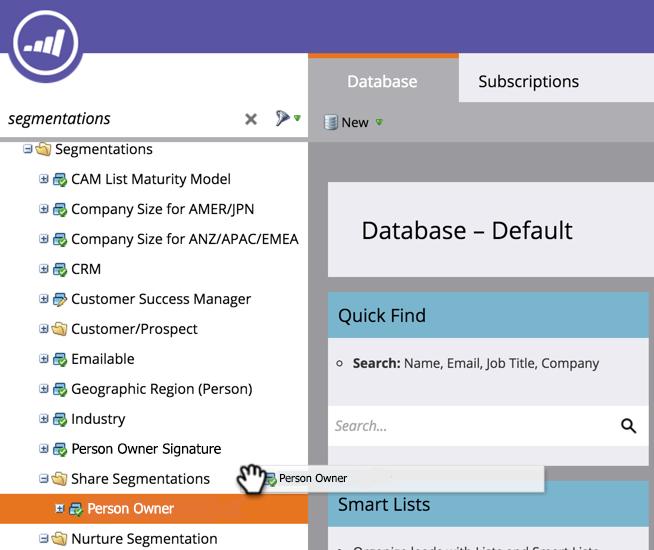
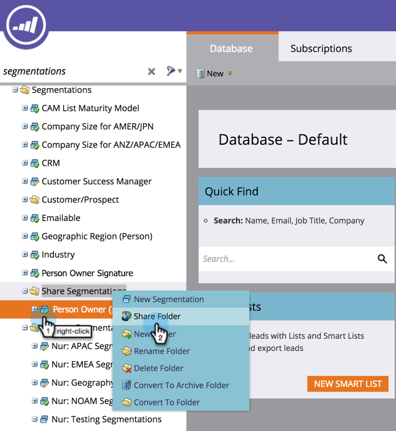

# Understanding Workspaces and Person Partitions {#understanding-workspaces-and-person-partitions}

## Workspaces {#workspaces}

>[!CAUTION]
>
>Workspaces can be complex to set up.  Contact  [Marketo Support](http://support.marketo.com/) to find out if they're right for you.

Workspaces are separate areas in Marketo that hold marketing assets like programs, landing pages, emails and more. They can be used by multiple people. Each user has access to one or more workspaces. 

>[!NOTE]
>
>**Example**
>
>Some reasons you might use a workspace:
>
>* Geography: Europe, Asia and North America marketing departments each get a workspace
>* Business Unit: Quicken, Quickbooks and TurboTax each get a workspace
>
>In each case, the separation is because the marketing assets are completely different. If they share marketing assets, then workspaces may not be the right tool for you.

>[!NOTE]
>
>**Deep Dive**
>
>Learn how to create [create a new workspace](create-a-new-workspace.md).

## Sharing across Workspaces {#sharing-across-workspaces}

Here's how to share assets across workspaces. It works the same for anything you want to share; this example shows segmentations.

>[!NOTE]
>
>The parent folder containing your assets is the only folder that can be shared, not the children folders.

1. Create a new folder.

   

1. Name the folder you're going to share.

   

1. Move the asset(s) you want to share into the folder.

   

1. Right-click the folder and select **Share Folder**.

   

1. Select the workspace(s) you want to share the folder with and click **Save**. The Share Folder dialog box will only display workspaces you have permission to view.

   

   >[!NOTE]
   >
   >The originating folder will now have a little green arrow, indicating it was shared. In the workspace shared, the folder will have a padlock, indicating read-only.

You can share these items across workspaces.

* Email templates
* Landing page templates
* Models
* Smart campaigns
* [Smart lists](../../../product-docs/core-marketo-concepts/smart-lists-and-static-lists/using-smart-lists/reference-a-list-or-smart-list-across-workspaces.md)
* [Segmentations](share-segmentations-across-workspaces-and-partitions.md)
* Snippets

## Cloning across Workspaces {#cloning-across-workspaces}

For assets that aren't templates, its best to clone them as local assets inside of a program.  With the proper access level, you can drag and drop these assets into another workspace:

* Programs
* Emails
* Landing Pages
* Forms

>[!NOTE]
>
>When cloning assets that have templates, those templates must be shared with the destination workspace.

## Moving Assets to other Workspaces {#moving-assets-to-other-workspaces}

To move assets to a new workspace, put them into a folder and drag the folder over to the other workspace.

>[!NOTE]
>
>You can't move a program that contains members from one workspace to another.

## Person Partitions {#person-partitions}

Person partitions act like separate databases. Each partition has its own people that do not de-dupe or mix with other partitions. If you feel you have a business use case that may necessitate having duplicate records with the same email address, please contact [Marketo Support](http://support.marketo.com).

You can assign person partitions to  [workspaces](create-a-new-workspace.md) in the following configurations:

* one workspace to one person partition (1:1)
* one workspace to many person partitions (1:x)
* many workspaces to one person partition (x:1)

>[!NOTE]
>
>**Example**
>
>Reasons you would use a person partition:
>
>* Your workspaces not only have different assets, but also don't share any people
>* You want duplicates for other business reasons
>

>[!CAUTION]
>
>Person partitions do not interact with each other, so be careful when setting them up.

>[!NOTE]
>
>**Deep Dive**
>
> Learn how to [create a person partition](create-a-person-partition.md).

