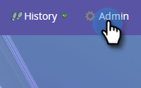
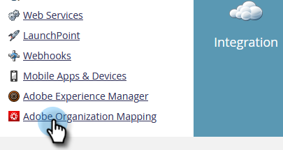
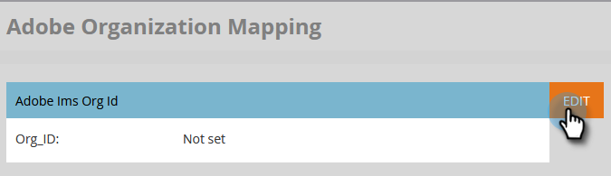

# Set up Adobe Organization Mapping {#set-up-adobe-organization-mapping}

In order to sync with Adobe applications, such as Audience Manager, the B2B CDP Marketo connector, [!DNL Dynamic Chat], etc., you must first enter your Adobe IMS Org credentials in Marketo Engage.

>[!NOTE]
>
>* A HIPAA-ready deployment of a Marketo instance cannot use this integration.
>* For the integration to work, Marketo and your other Adobe applications must be in the same org.

>[!IMPORTANT]
>
>For those onboarded to the Adobe Business Platform and Identity Management System, the Org ID associated with the subscription will already be populated and is a read-only field. As such, the steps in this article would not apply.

1. In Marketo, click **[!UICONTROL Admin]**.

   

1. Under Integration, click **[!UICONTROL Adobe Organization Mapping]**.

   

1. Click **[!UICONTROL Edit]**.

   

1. Enter your Adobe IMS Org ID (learn how to find that [here](https://experienceleague.adobe.com/docs/control-panel/using/faq.html){target="_blank"}) and click **[!UICONTROL OK]**.

   

1. Click **[!UICONTROL Confirm]**.

   

1. Click **[!UICONTROL Close]**.

   

   >[!IMPORTANT]
   >
   >For security reasons, you must be an Org Admin for the Adobe Organization that you want to map to. If you're not, the action will fail. Additionally, the Adobe User and Marketo User must use the same email address when logging in.

1. If you're _not_ already logged in, a pop-up will appear in a new tab/window. Log in to your Adobe org (this action validates the org access).

And that's it! You can now [share audience data](/help/marketo/product-docs/core-marketo-concepts/smart-lists-and-static-lists/static-lists/send-a-list-to-adobe-experience-cloud.md){target="_blank"} to, or [sync an audience](/help/marketo/product-docs/adobe-experience-cloud-integrations/sync-an-audience-from-adobe-experience-cloud.md){target="_blank"} from Adobe Experience Cloud.
