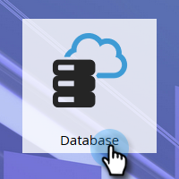
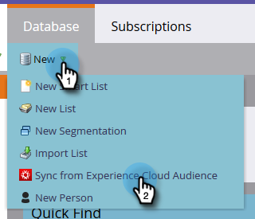
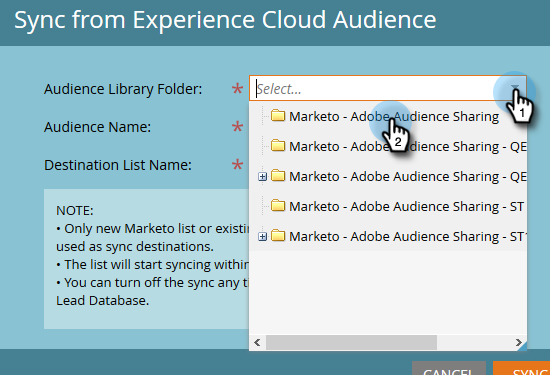
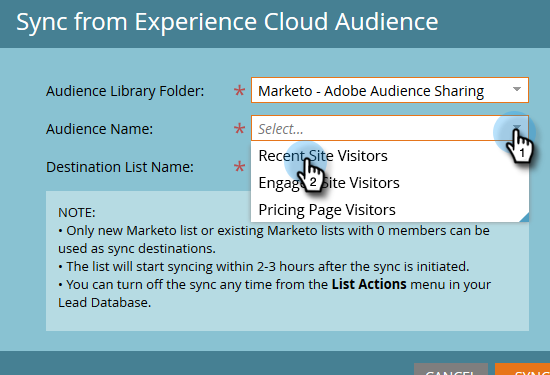
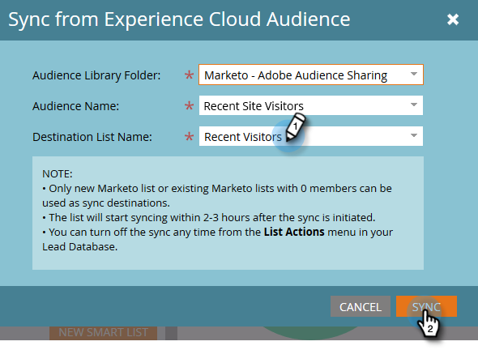
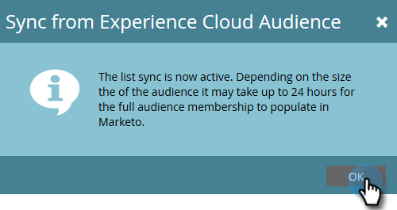

# Sync an Audience From Adobe Experience Cloud {#sync-an-audience-from-adobe-experience-cloud}

>[!NOTE]
>
>A HIPAA-ready deployment of a Marketo instance cannot use this integration.

>[!PREREQUISITES]
>
>[Set Up Adobe Organization Mapping](/help/marketo/product-docs/adobe-experience-cloud-integrations/set-up-adobe-organization-mapping.md){target="_blank"}

## How to Sync an Audience {#how-to-sync-an-audience}

1. In My Marketo, click the **[!UICONTROL Database]** tile.

   

1. Click the **[!UICONTROL New]** drop-down and select **[!UICONTROL Sync from Experience Cloud Audience]**.

   

1. Click the **[!UICONTROL Audience Library Folder]** drop-down and select the desired origin folder.

   

1. Select an **[!UICONTROL Audience Name]**.

   

1. For the destination, you can select an existing list, or type the name of a new one. In this example we're creating a new one. Click **[!UICONTROL Sync]** when done.

   

1. Click **[!UICONTROL OK]**.

   

## FAQ {#faq}

**How does the cookie sync work?**

When the cookie sync is enabled for your Marketo Subscription, Marketo's munchkin.js will attempt to capture and store Adobe ECIDs for the Adobe IMS Org you specified during the integration setup and match these ECIDs to the corresponding Marketo cookie identifier. This enables Marketo's anonymous user profiles to become enriched with Adobe ECIDs.

A further step is required to associate the anonymous user profile to a Lead Profile, which is identified using a plain text email. Exactly how this works [is described here](/help/marketo/product-docs/reporting/basic-reporting/report-activity/tracking-anonymous-activity-and-people.md){target="_blank"}.

**Why is the list size in Marketo different than the one in Adobe?**

A person will also not sync over if we are unable to tie an ECID cookie ID to a known person in Marketo.

**Is this a one-time sync?**

You only need to initiate the sync once. After that, records will sync automatically. The initial sync can take up to 24 hours; going forward, new records will sync in 2-3 hours.
