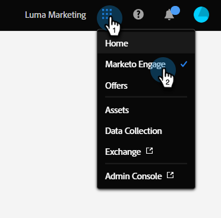
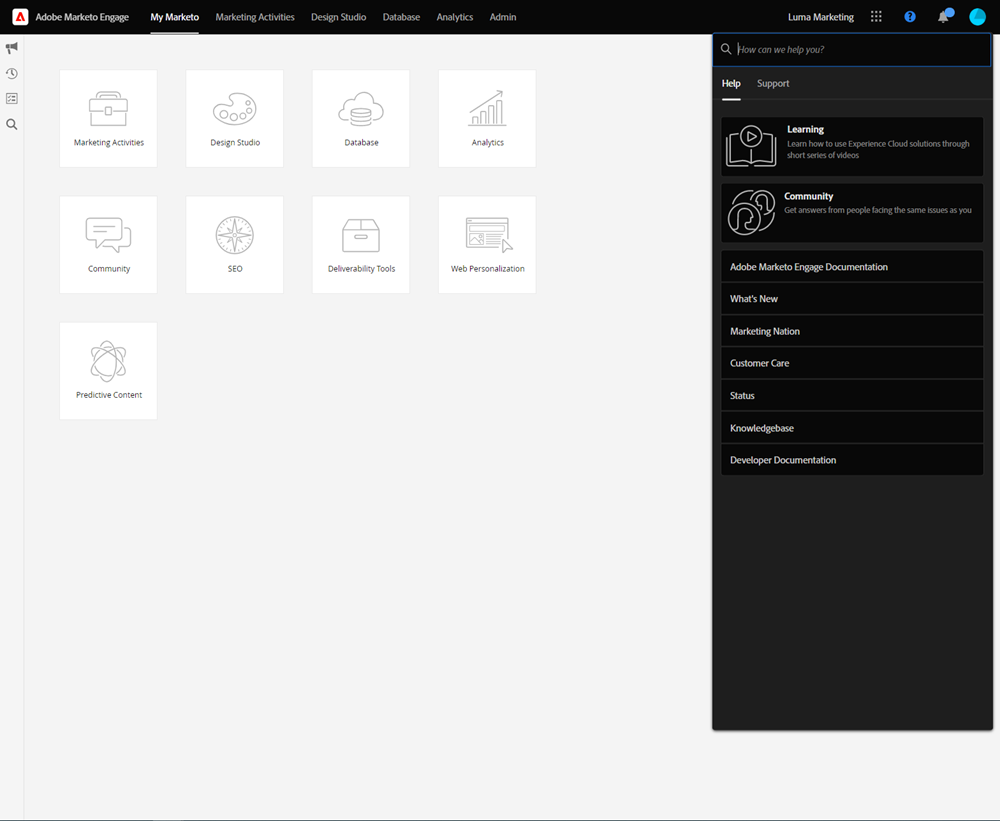
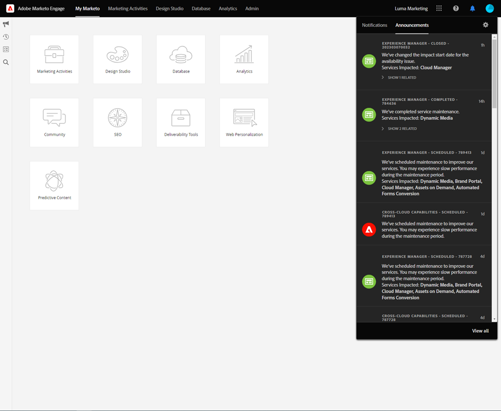
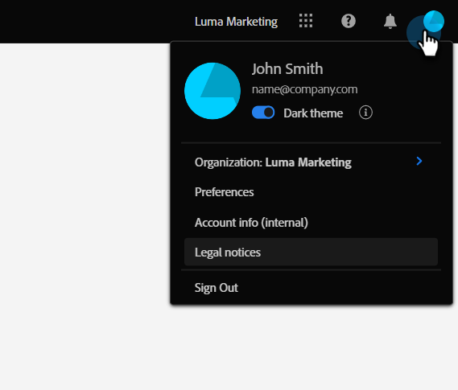
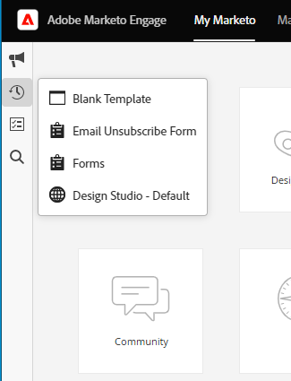
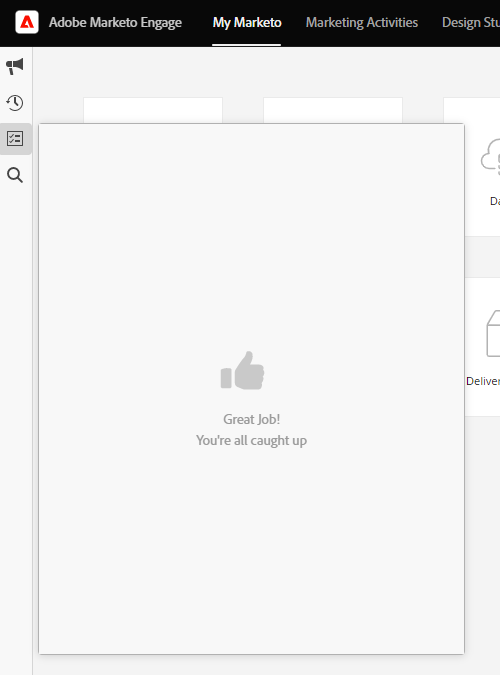

# Unified Shell Overview {#unified-shell-overview}

Unified Shell aligns the "shell" look and feel of Adobe Experience Cloud applications and services. But, it's more than just a new design. It's a single-page application that delivers user experience in a single instance.

## User Flow {#user-flow}

**Unified Shell Flow**

If you're not already logged in to an Adobe Experience Cloud product, log in directly to [!DNL Marketo Engage] here: [https://experience.adobe.com/marketo-engage](https://experience.adobe.com/marketo-engage).

If you _are_ already logged in to an Adobe Experience Cloud product, simply click the menu icon and select **[!DNL Marketo Engage]**.

   

>[!NOTE]
>
>Your drop-down menu may look different depending on which Adobe Experience Cloud products you're subscribed to.

## New Features {#new-features}

In addition to the updated look and feel, you'll notice the following features:

**Integrated Help Center**

Access a variety of available help resources from within the [!DNL Marketo Engage] application.

   

**Application Switcher**

Those with access to multiple Adobe products will be able to easily toggle between them.

   

**Notifications and Announcements**

View and interact with product-specific notifications and general Adobe product announcements directly in the application.

   

**Adobe Settings**

Click your profile icon to change your language or other Adobe-wide preferences.

   

## FAQ {#faq}

**I can't log in to [!DNL Marketo Engage] through the Unified Shell. What might the issue be?**

If you can log in to Adobe Experience Cloud, but then see "Failed to load page" error, the issue could be on the [!DNL Marketo Engage] side. Please contact [Marketo Support](https://nation.marketo.com/t5/support/ct-p/Support) for assistance.

**Where did User History, Global Search, Marketo Notifications, and the Task Tray go?**

These features have moved from the top nav to a new bar on the left hand side in Unified Shell.

   

   
