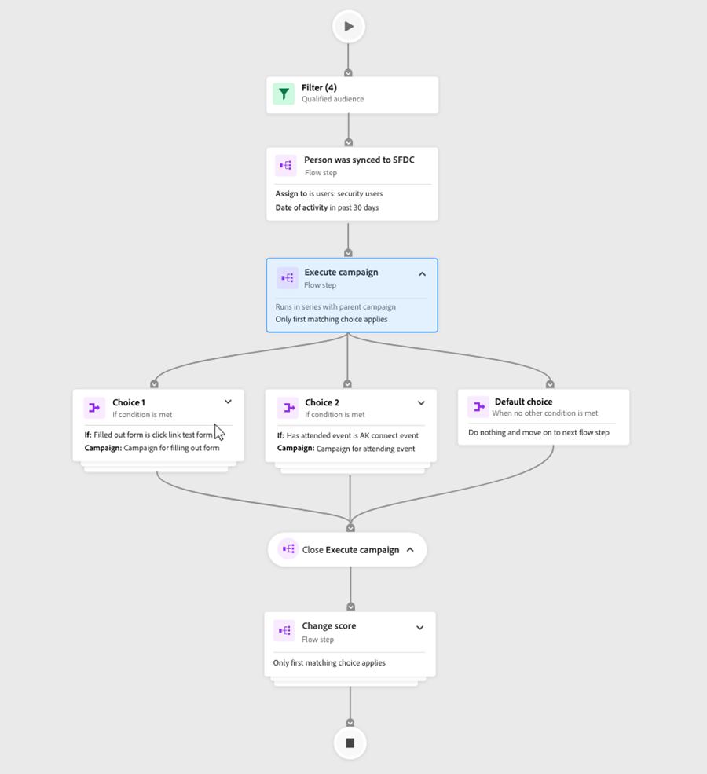
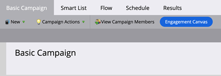
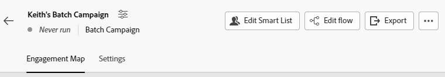

# Engagement Map Overview {#engagement-map-overview}

The Engagement Map allows you to build out reusable Smart Campaigns with the help of intuitive visuals. It offers full backward compatibility with all existing Marketo Engage Smart Campaigns, without the loss of any current features. 

>[!NOTE]
>
>Engagement Map is currently available in Smart Campaigns. It is not available in Programs.

   

## Accessing Engagement Map {#accessing-engagement-map}

Navigate to any existing campaign and click the **Engagement Map** button.

   

Once in the Engagement Map, you'll see two tabs: [Engagement Map](/help/marketo/product-docs/core-marketo-concepts/engagement-map/engagement-map-tab.md){target="_blank"} and [Settings](/help/marketo/product-docs/core-marketo-concepts/engagement-map/settings-tab.md){target="_blank"}.

   

## Card Descriptions {#card-descriptions}

**Triggers**: In campaigns that include triggers, the map will have a "Trigger Overview" card. Clicking on this will reveal a card for each trigger, as well as a slide-out panel with additional information.

**Filters**: In campaigns that include filters, the map will contain a Filter Overview card. Clicking on it will reveal a slide-out panel with additional information on each filter.

**Flow Steps**: Each campaign will include a card for each flow step. Clicking on them will reveal a slide-out panel with additional information.

**Choices**: If a flow step includes one or more choices, clicking on the flow card will reveal a card for each choice, as well as a slide-out panel with additional information.

## Nested Campaigns {#nested-campaigns}

* If a campaign includes a Request or Execute Campaign flow step, clicking on the flow card will show details of the campaign being called as well as a slide-out panel with additional information.

* If a campaign includes a Request or Execute Campaign flow step with choices, clicking on the flow card will show a card for each choice, as well as a slide-out panel with more information about the choices. Clicking on each choice card will show details of the campaign being called as well as a slide-out panel with more information.

* Additionally, if any of the nested campaigns have a Request or Execute Campaign flow step, clicking on the flow card will show details of the campaign. The same is applicable when the flow step includes choices.

## Top Navigation {#top-navigation}

The top nav includes the following features:

* Campaign name and access to "Edit Campaign" modal, you can edit the campaign name and description here.

* Campaign status and type of campaign will be reflected below the campaign name

* Activate/Deactivate button for Trigger campaigns

* Edit Smart List - you will be navigated to the Smart List interface in a new tab where you can add or edit your filters and/or triggers

* Edit Flow - you will be navigated to the Flow interface in a new tab where you can add or edit your Flow Steps

* Export - This will download an image of the campaign visualization. The version downloaded will reflect any branches that you have expanded

* View Campaign Members - This will open a new tab with Campaign Member details.  

>[!NOTE]
>
>Changes made in an open Smart List and Flow tab will be reflected in the Engagement Map tab upon refresh. It will not automatically update. Updates and edits that are auto-saved will be reflected upon refresh of the Engagement Map tab.

## FAQ {#faq}

**Do I have to rebuild all my campaigns in Engagement Map?**

No. Engagement Map has full backwards compatibility. With the click of a button, you'll be able to see each of your existing campaigns in the visual Engagement Map interface.

**Does having Engagement Map in Marketo Engage mean I'll lose access to the folder structure and will have to re-learn how to build a Smart Campaign?**

No. The great thing about Engagement Map is that it gives you the best of both worlds; it's complementary to the current way you build campaigns. You can choose if you want to use the existing UI or build/visualize in the new UI. All users will still get Marketo Engage's powerful feature set, now complemented by a visual creation tool.

**Is Engagement Map a paid add-on?**

No. All existing and new Marketo Engage users under all subscriptions will have access to this complimentary feature.

**As a Marketo Engage admin, am I responsible for turning Engagement Map on/off?**

No. Engagement Map will be available for all users in their instances. You will not be able to turn it on/off for certain users, workspaces, etc.

**Is everything currently available in Smart Campaigns also available in Engagement Map?**

Yes. Engagement Map has full feature parity with Smart Campaigns.

**How is this different from other visual builders?**

There are three key things that set Engagement Map apart: 

* Flexibility: Easily manage and validate interconnected or deeply nested campaigns with visualization.

* Functionality: All visuals are out of the box, making it easier to use; the nested structure allows you to dive in and get the whole picture.

* Power: You retain all the existing sophistication of Marketo Engage, now in a visual format.

>[!MORELIKETHIS]
>
>* [Engagement Map Tab](/help/marketo/product-docs/core-marketo-concepts/engagement-map/engagement-map-tab.md){target="_blank"}
>* [Settings Tab](/help/marketo/product-docs/core-marketo-concepts/engagement-map/settings-tab.md){target="_blank"}
