# Engagement Map Tab {#engagement-map-tab}

Engagement Map is represented through a series of trigger, filter, and flow cards. Clicking on each card will reveal additional information.

Trigger Overview: This card shows the number of triggers in your campaign. Clicking on it will reveal a card for each trigger, as well a slide-out panel with the following information:

* Campaign the trigger belongs to
* List of trigger names
* Edit Trigger

   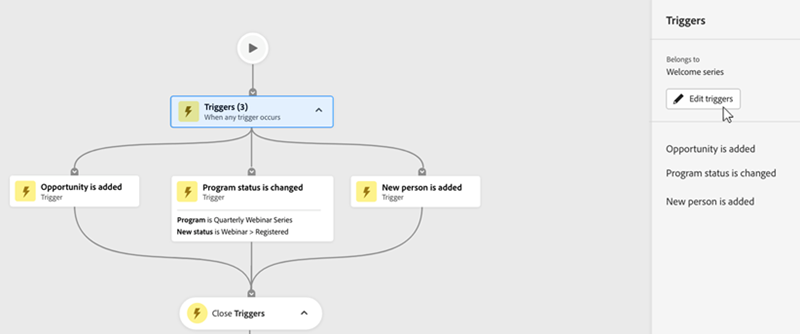

Trigger Detail: This card shows the trigger name. Clicking on it will reveal a slide-out panel with the following information: 

* Campaign the trigger belongs to
* List of constraints associated with the trigger
* Edit Trigger

Filter: Clicking on this card will reveal a slide-out panel with the following information:

* Campaign the filter belongs to
* Estimated number of people who qualify for the filter
* List of filters and their respective constraints
* Edit Filter

   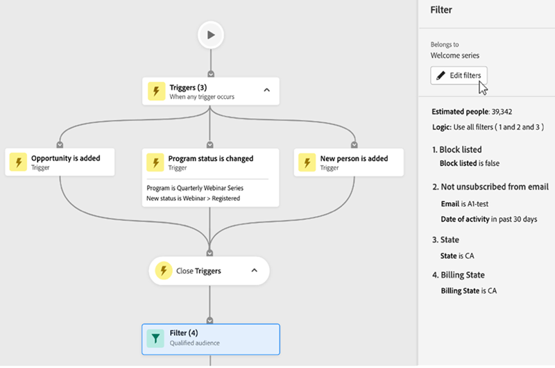

Flow Steps: If a Flow Step includes choices, this card will show the name of the Flow Step. Clicking on it will reveal a slide-out panel with the following information:

* Campaign the Flow Step belongs to 
* List of choice conditions associated to the Flow Step
* Edit Flow Step

Flow Steps: If a Flow Step does _not_ include any choices, this card will show the attributes associated to the Flow Step. Clicking on it will reveal a slide-out panel with the following information:

* Campaign the Flow Step belongs to
* List of attributes associated to the Flow Step
* Edit Flow Step

   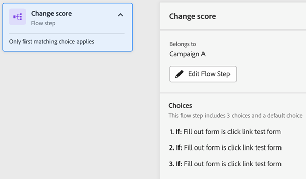

## Flow Step for Execute and Request Campaigns {#flow-step-for-execute-and-request-campaigns}

* If the Execute or Request Campaign Flow Step does not include any choices, the card will show the name of the campaign. Clicking on the card will reveal a slide-out panel with the following information:

   * Campaign the Flow Step belongs to 
   * Edit Flow Step
   * List of attributes associated to the Flow Step 
   * "View List" button, which opens a list of campaigns that use the specific Request/Execute Campaign

>[!NOTE]
>
>You can edit the Flow Step(s) from a primary campaign. To edit nested campaigns, you'll have to navigate to the campaign via the link in the slide-out panel.

* If the Execute or Request Campaign Flow Step includes choices, clicking on the card will reveal a slide-out panel with the following information: 

   * Campaign the Flow Step belongs to
   * List of choice conditions associated to the Flow Step
   * Edit Flow Step

* If an Execute or Request Campaign includes choices, clicking on the flow card will expand to show all choices in individual cards. Clicking on the _choice_ card will expand the campaign associated to the specific choice as well as reveal a slide-out panel with the following information:

   * Campaign the choice belongs to
   * Edit choice
   * List of choice conditions associated to the Flow Step
   * View list, which opens a list of campaigns that use the specific Request/Execute Campaign

   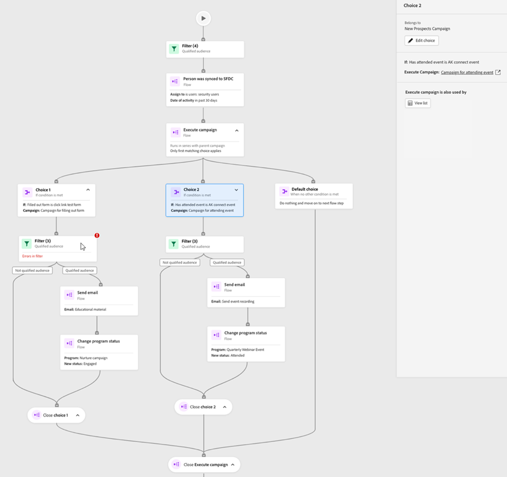

## Visualizing a Nested Execute Campaign {#visualizing-a-nested-execute-campaign}

Execute campaigns run in series with the parent campaign. People that qualify for an executable campaign complete all Flow Steps from the campaign and return to the primary campaign to continue through the Flow Steps of this campaign.

Below is an example of a Smart Campaign, "Campaign A," which includes an execute campaign Flow Step. Think of "Campaign A" as your primary campaign. 

   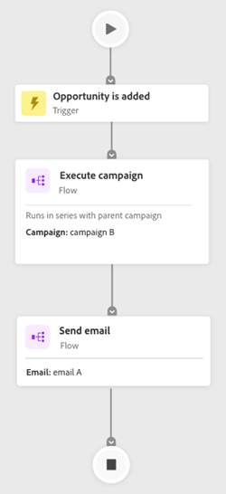

1. Clicking on the execute campaign flow card will expand to show details of "Campaign B".
1. "Campaign B" includes a filter that splits the audience into two groups: qualified and not qualified.  
1. Qualified audience goes through the Flow Steps associated to "Campaign B."
1. All audience (qualified and not qualified) return to "Campaign A" and move on to the next Flow Step.

   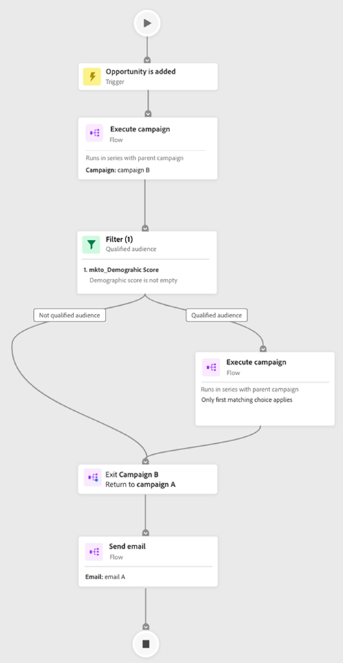

You can click on the Execute Campaign Flow Step in "Campaign B" which will expand to show the choice cards and campaign associated with each choice.

   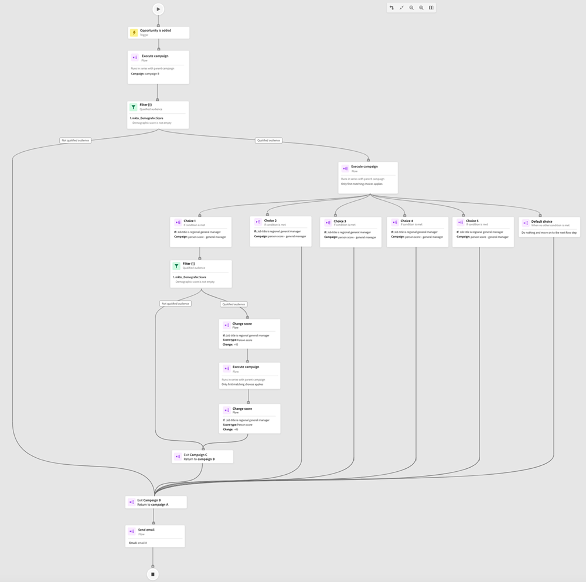

## Visualizing Request Campaign {#visualizing-request-campaign}

Request campaigns run in parallel with the parent campaign. People that qualify for a request campaign complete all the Flow Steps from the campaign and then exit the campaign. Concurrently, the same set of people go through the Flow Steps from the primary campaign. 

Here's an example of a Smart Campaign, "Campaign A," which includes a request campaign Flow Step. Think of "Campaign A" as your primary campaign.

   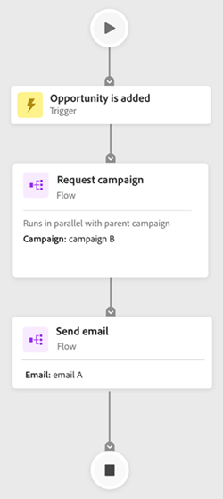

1. Clicking on the request campaign flow card will expand to show the details of "Campaign B" 
1. "Campaign B" includes a filter that splits the audience into two groups: qualified and not qualified.    
1. Qualified audience goes through the Flow Steps associated to "Campaign B."
1. At the same time, all audience moves to the next Flow Steps in "Campaign A." 

   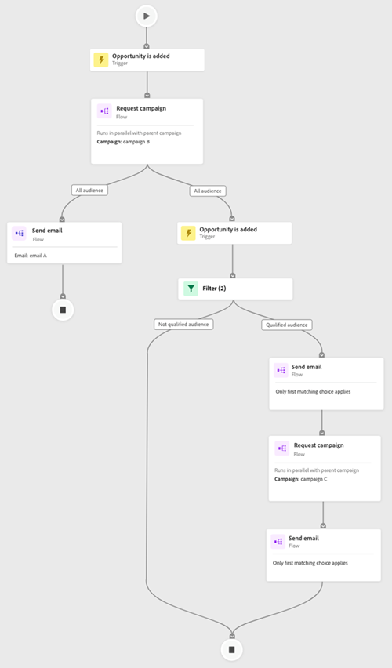

You can dive deeper into your nested campaigns if any of the Flow Steps include another request campaign by clicking on the flow card to view the details of the campaign.

   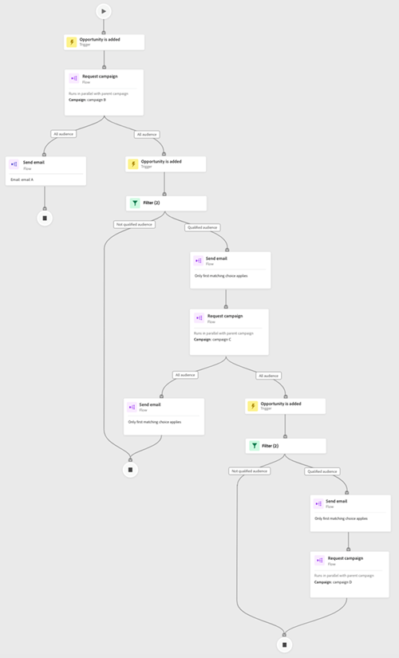

Here's an example of a request campaign with choices.  

   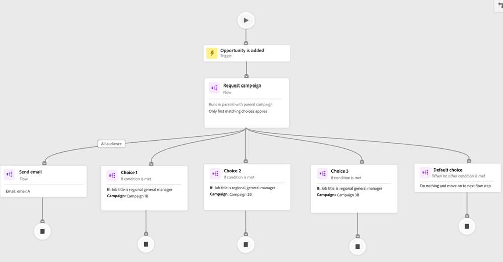

## Error Handling {#error-handling}

Errors in Smart Lists and Flow Steps will be highlighted via an error icon in the card. Additionally, a corresponding error message will be reflected in the slide-out panel.

Below is an example of an error in a trigger which shows in the trigger overview card, slide-out panel, and the detail trigger card.

**Errors in filter cards can include:**

* An error in the Smart List which will result in qualified audience not being shown 

* An error in the filter logic 

* An error in constraints (or lack thereof) in one or more filters 

   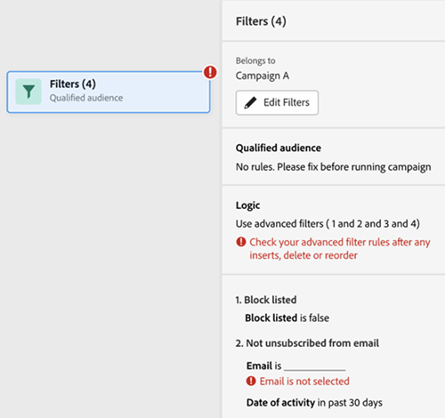

>[!NOTE]
>
>Errors within a nested campaign won't be visible until you've clicked to expand the nested campaign.
