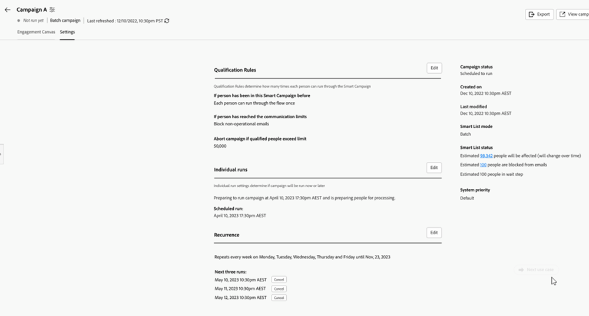
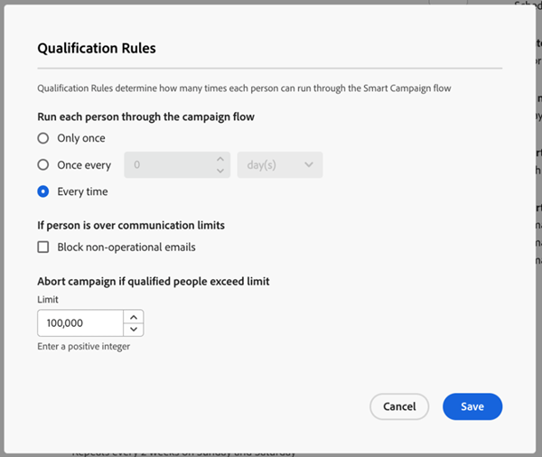
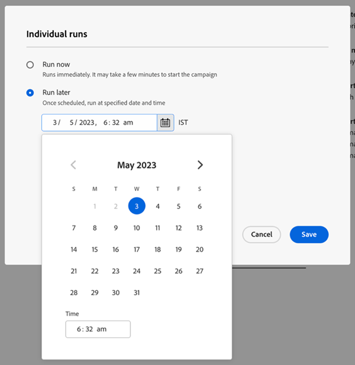
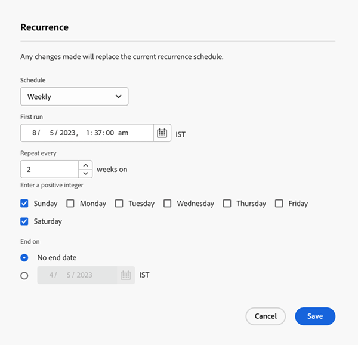
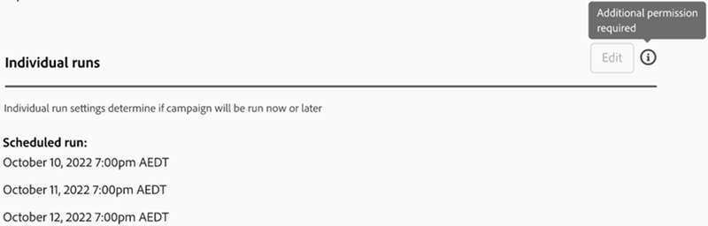
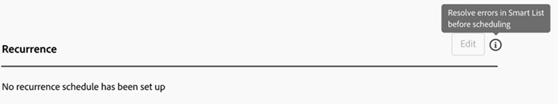

# Settings Tab {#settings-tab}

The Settings tab is home to all your campaign settings, including the same permission sets and access as the Schedule tab in Smart Campaigns.

It includes the following three sections.

* **Qualification Rules**: Determines how many times each person can run through the Smart Campaign flow.

* **Individual Runs**: Can be used to schedule single runs either immediately or in the future.

* **Recurrence**: Used to schedule a daily, weekly, or monthly recurrence.

   

Qualification rules will be available for all campaigns (trigger and batch) and include the following settings:

* You can determine how many times a person goes through a campaign 
* The ability to block a non-operational campaign if the person is over their communication limit  
* The ability to set an abort campaign people limit 

   

Individual runs can be used to either run a campaign immediately, or to set up some one-off runs in the future.

>[!TIP]
>
>It's easier to use the recurrence modal if you're scheduling a series of campaigns.

   

The recurrence modal includes the ability to set up a recurring schedule on a daily, weekly, or monthly basis. Once set up, you'll be able to see the next three runs in the Settings tab.

   

The Settings tab also includes a quick overview of your Smart Campaign. It includes the following: 

* Campaign status 
* Created on 
* Last modified 
* Smart List mode 
* Smart List status:  
   * Estimated people who will be affected 
   * Estimated people who are blocked from emails 
   * Estimated people who are in a wait step

Permission sets and Errors in Settings tab: 

All existing permission sets will be applicable in the Settings tab. If the Edit button is grayed out, please click the help icon to find out why.

>[!NOTE]
>
>If after clicking the help icon you see "Additional Permission Required," please reach out to your Marketo Admin.

   

   
