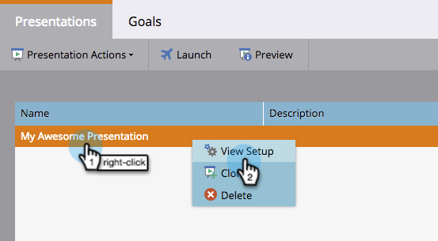

# Add a Background Image to a Presentation {#add-a-background-image-to-a-presentation}

Customize a presentation by selecting a background image.

>[!PREREQUISITES]
>
>[Create a Presentation](/help/marketo/product-docs/core-marketo-concepts/marketing-calendar/calendar-hd/create-a-presentation.md)

1. Right-click a presentation and select **View Setup**.

   >[!NOTE]
   >
   >You can also double-click a presentation to enter the setup tab.

   

1. Drag and drop **Background Image** from the right tree into the canvas.

   

1. Select an image from the image library.

   >[!TIP]
   >
   >For the cleanest look, use an image that's **1920 x 1080** or **1280 x 720**.

   

1. Click **Preview** to check it out.

   

   And that's it!
