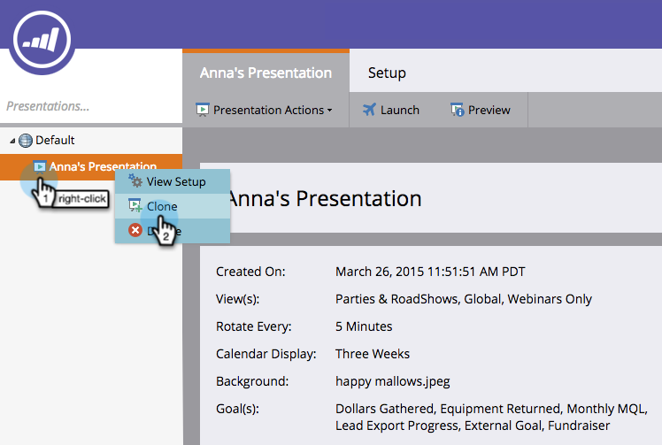
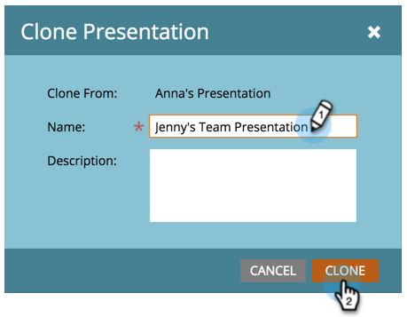

# Clone a Presentation {#clone-a-presentation}

Clone a presentation for reuse in different places.

1. Select the presentation you want to clone.

   

1. Right-click the presentation and select **Clone**.

   

1. Enter a name for the cloned presentation and click **Clone**.

   

   Great! An exact copy of your presentation now exists.
