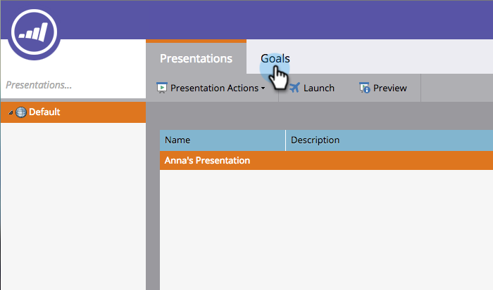
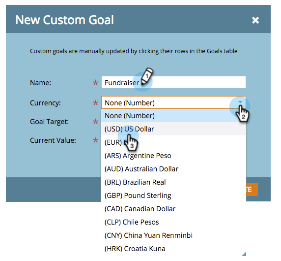
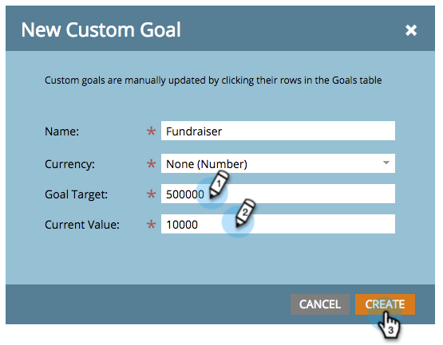
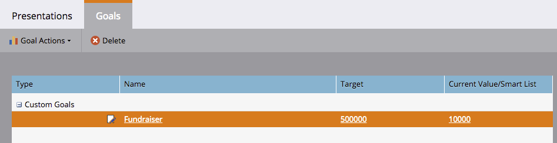

# Create a Custom Goal {#create-a-custom-goal}

Goals are ways to track progress and motivate your team. Once created, they must be manually updated.

Like presentations, goals are [workspace](../../../../product-docs/administration/workspaces-and-person-partitions/understanding-workspaces-and-person-partitions.md)-specific.

1. Go to the&nbsp;**Calendar**.

   

1. Click **Presentation** in the bottom right corner.

   

1. Select the** Goals** tab.

   

1. Drag and drop **Custom Goal** into the canvas.

   

1. Enter a name for the goal. Select a **Currency**.

   >[!NOTE]
   >
   >If the goal is not a monetary value you can select **None**.

   

1. Enter a value for the **Goal Target** and the **Current Value** (if there isn't one, **enter 0**). Then click **Create**.

   

   Your custom goal has been created!

   

