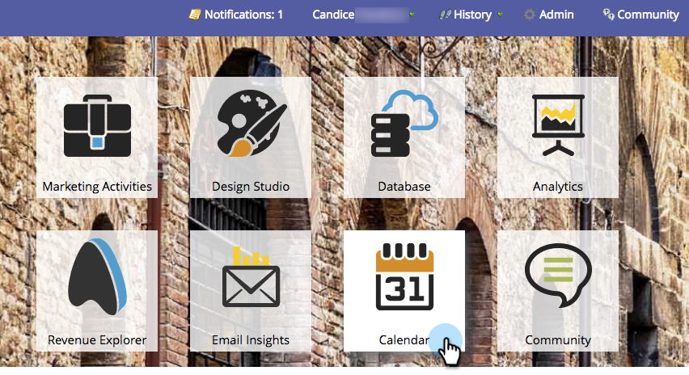
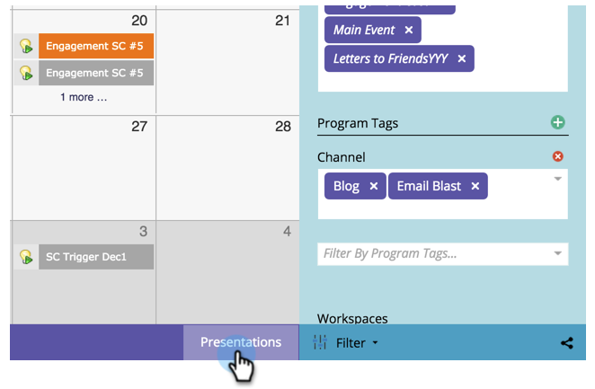
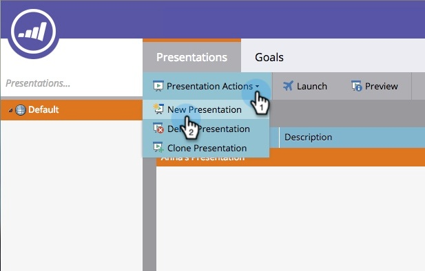

# Create a Presentation {#create-a-presentation}

Create a presentation to project your team's calendar views and goals on an HDTV. Presentations are Workspace-specific.

>[!NOTE]
>
>**Availability**
>
>Not all customers have purchased this functionality. Contact your sales rep for details.

1. Go to the** Calendar**.

   

1. Click **Presentation** in the bottom right corner.

   

1. Click **Presentation Actions** and select **New Presentation**.

   

1. Choose a name for the presentation. Click **Create**.

   

   Nice job! Now you're ready to customize your presentation.

>[!NOTE]
>
>**Related Articles**
>
>* [Customize a Presentation](customize-a-presentation.md)
>

