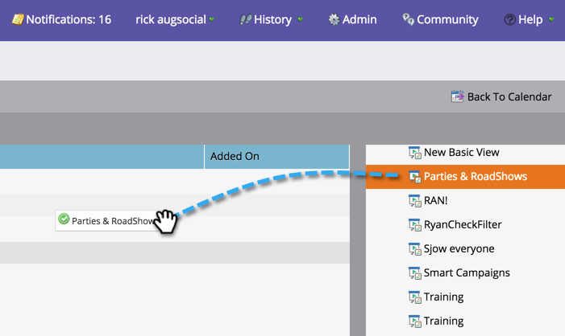
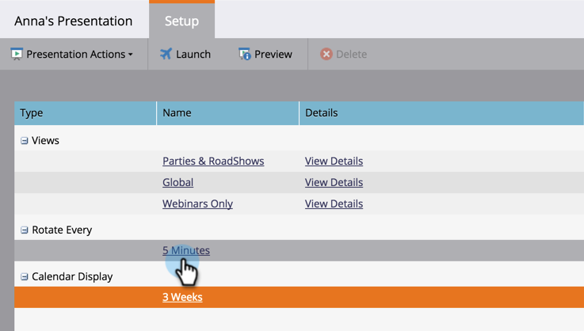
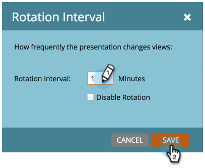
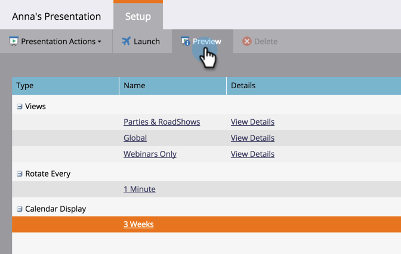

# Customize a Presentation {#customize-a-presentation}

Set up your calendar presentation to reflect the goals and activities that matter most to your team.

>[!NOTE]
>
>**Availability**
>
>Not all customers have purchased this functionality. Contact your sales rep for details.

>[!NOTE]
>
>**Prerequisites**
>
>* [Create Custom Goals](create-a-custom-goal.md) or [Smart List Goals](create-a-smart-list-goal.md)
>
>* [Create a Presentation](create-a-presentation.md)
>

### What's in this article? {#whats-in-this-article}

[Choosing the Views](#choosing-the-views)  
[Add a Goal](#add-a-goal)  
[Set the Frequency of Rotation](#set-the-frequency-of-rotation)  
[Set the Calendar Display](#set-the-calendar-display)  
[Preview a Presentation](#preview-a-presentation)

#### Choosing the Views {#choosing-the-views}

Presentations cycle through different [filter definitions](../../../../product-docs/core-marketo-concepts/marketing-calendar/working-with-the-calendar/filtering-the-marketing-calendar.md) you choose. Pull in as many views as you like and customize the frequency.

1. From the right tree, drag in the different views you want rotated through in your presentation.

   

#### Add a Goal {#add-a-goal}

Presentations are the most awesome when they display your team goals. Just drag over different [custom goals](create-a-custom-goal.md) or [smart list goals](create-a-smart-list-goal.md). You can use up to 10.

1. From the right tree, drag in different goals you want displayed in your presentation.

   

#### Set the Frequency of Rotation {#set-the-frequency-of-rotation}

Once you've pulled in the views you want in the presentation, set the frequency at which it rotates between the different views.

1. Click** 5 minutes** (this is the default cadence).

   

1. Enter a time using minutes. Click **Save**.

   >[!NOTE]
   >
   >Display one static view by checking **Disable Rotation**.

   

#### Set the Calendar Display {#set-the-calendar-display}

The calendar display can be changed to a 3-week or monthly view.

1. Select the **Calendar Display** drop-down and choose between **3 weeks** or one **Month**.

   

   Awesome! Ready to see your presentation?

>[!TIP]
>
>Set a [background image](add-a-background-image-to-a-presentation.md) for your presentation. We suggest kittens or rainbows.

#### Preview a Presentation {#preview-a-presentation}

Once the presentation has been configured, it's ready to be previewed and launched.

1. Select **Preview**.

   

   Ta-da! This is what your presentation might look like.

   

   Don't like what you see? Go back and use different filter definitions to create the view you like.

>[!NOTE]
>
>**Related Articles**
>
>* [Add a Background Image to a Presentation](add-a-background-image-to-a-presentation.md)
>* [Launch a Presentation](launch-a-presentation.md)
>

