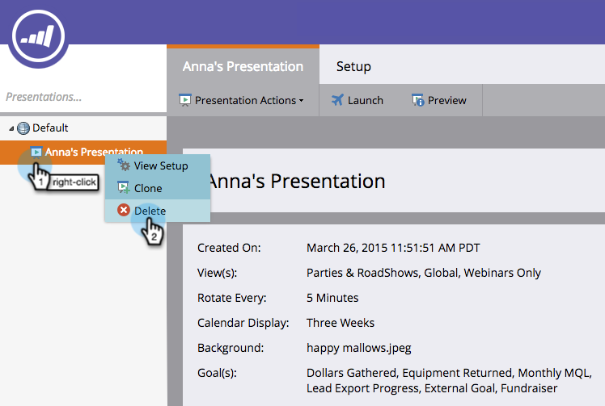

# Delete a Presentation {#delete-a-presentation}

Sometimes you can have too much of a good thing. Delete old presentations to make room for new ones!

1. Select a presentation.

   

1. Right-click and select **[!UICONTROL Delete]**.

   

1. Click **[!UICONTROL Delete]** to confirm.

   

   Poof! Out of sight, out of mind.
