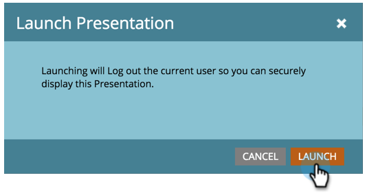

# Launch a Presentation {#launch-a-presentation}

Once you've set the views and rotation frequency for your presentation, it's time for blast off!

>[!NOTE]
>
>**Availability**
>
>Not all customers have purchased this functionality. Contact your sales rep for details.

>[!NOTE]
>
>**Prerequisites**
>
>* [Create a Presentation](create-a-presentation.md)
>* [Customize a Presentation](customize-a-presentation.md)
>

>[!TIP]
>
>Make sure to **Preview a Presentation** before you launch.

1. Click **Launch**.

   

1. Click **Launch** one more time. This will log you out of Marketo so that the presentation can be displayed securely.

   

   >[!TIP]
   >
   >Your presentation will launch in a new tab. If needed, move the tab to an external monitor or TV for display and click **Fullscreen** (or press **F11 **on your keyboard if you're using Internet Explorer).

